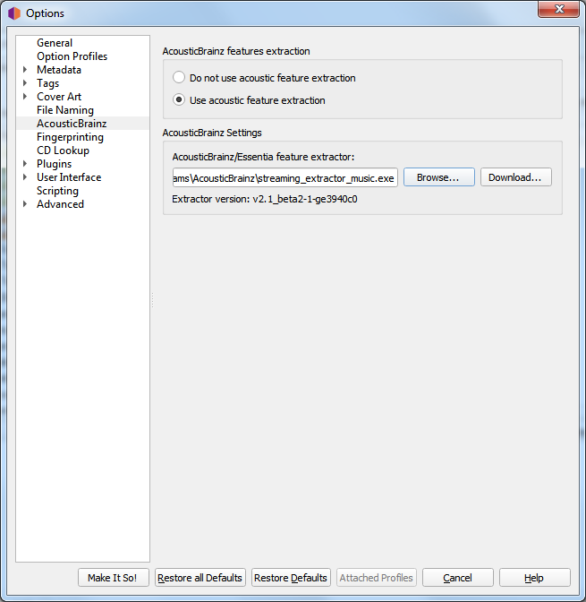

.. MusicBrainz Picard Documentation Project

:index:`AcousticBrainz Options <configuration; acousticbrainz>`
===============================================================

Beginning with v2.7, Picard can analyze music files and submit the information to `AcousticBrainz <https://acousticbrainz.org/>`_.
Information can only be submitted if the file is properly tagged with MusicBrainz identifiers.  In order to provide this functionality
Picard must be provided with a link to an appropriate extraction application.  If no link is provided, Picard will attempt to find an
extractor in the application directory.

**AcousticBrainz features extraction**

   This allows you to select whether or not to enable acoustic features extraction within Picard. If acoustic features extraction is
   disabled then all remaining options in this tab will be locked and ignored.

   If enabled and a proper extractor application is available, the "Submit AcousticBrainz features" command will be enabled in the
   "Tools" section of Picard's main menu bar, when either a properly tagged file or release is selected.

**AcousticBrainz settings**

   This section allows you to specify the acoustic features extractor application to use for processing the audio files.  There is also
   an option with a link to download a client application from the AcousticBrainz website.

.. seealso::

   Please see the :doc:`../usage/submit_acousticbrainz` section for additional information.
