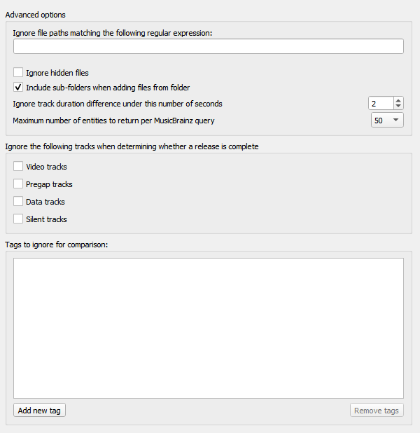

.. MusicBrainz Picard Documentation Project

:index:`Advanced Options <configuration; advanced options>`
============================================================

**Ignore file paths matching the following regular expression**

    You can specify patterns for files and directories that Picard should never load.
    For example, if you set this to the regular expression ``\.bak$`` any file ending in ".bak"
    will be ignored when loading files.

**Ignore hidden files**

    If this option is enabled then hidden files and directories will not be loaded. This also
    includes any file or subdirectory inside a hidden directory.

**Include sub-folders when adding files from folders**

    If this option is enabled Picard will load all audio files in the selected directory and all
    its subdirectories. If disabled only audio files in the selected directory will be loaded.

**Ignore track duration difference under this number of seconds**

    This specifies the number of seconds that a file can differ in length from the length in the
    MusicBrainz database and still be considered to be the same.  The default value is 2 seconds.

**Ignore the following tracks when determining whether a release is complete**

    Missing tracks of the selected type (i.e.: video, pregap, data or silence) will be ignored when
    determining whether a release is considered to be complete. For example, if "video" is selected
    then a release with a bonus video will be marked as complete if it has all the audio tracks
    matched with a file even if the video file is missing.

**Tags to ignore for comparison**

    Tags in this list will not be considered when comparing the existing file metadata to the data
    retrieved from MusicBrainz. If the only difference between the file's metadata and the metadata
    retrieved from MusicBrainz is a tag listed in this ignore list then the file will be
    considered unmodified.

.. only:: html

   .. seealso::

      Details:
      :doc:`options_network` /
      :doc:`options_matching`

.. toctree::
   :hidden:

   options_network
   options_matching
