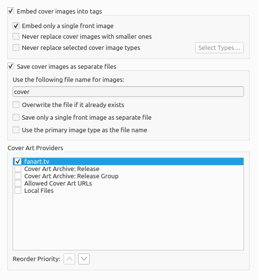

.. MusicBrainz Picard Documentation Project

:index:`Cover Art Options <pair: configuration; cover art>`
===========================================================

.. note::

   You must enable :menuselection:`"Options --> Metadata --> Use release relationships"` for Picard to be able to download cover art from MusicBrainz cover art relationships.

.. only:: html and not epub

   .. seealso::

      Details:
      :doc:`options_location` /
      :doc:`options_cover_art_providers` /
      :doc:`options_cover_art_archive` /
      :doc:`options_local_files`

.. toctree::
   :hidden:

   options_location
   options_cover_art_providers
   options_cover_art_archive
   options_local_files
