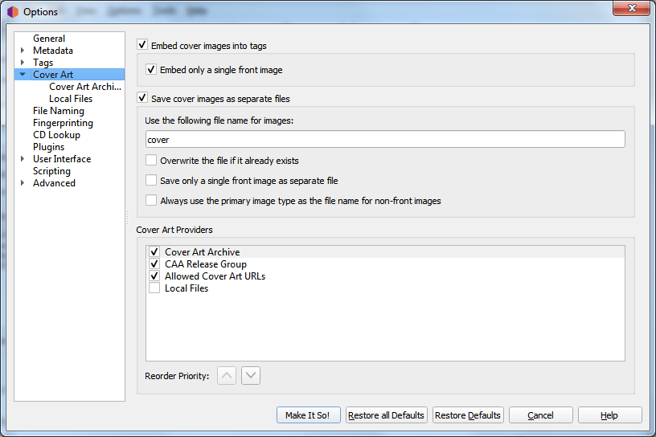

.. MusicBrainz Picard Documentation Project

:index:`Cover Art Options <pair: configuration; cover art>`
===========================================================

**Embed cover images into tags**

   Enables images to be embedded directly into your music files. While this will use more storage space than storing it as a separate image file in the same directory, some music players will only display embedded images and don't find the separate files.

**Embed only a single front image**

   Embeds only a single front image into your music files. No other images, regardless of their type, will be embedded. Many music players will only display a single embedded image, so embedding additional images may not add any functionality.

**Never replace cover images with smaller ones**

   Enabling this setting will prevent Picard from replacing an embedded cover image with one having smaller dimensions.

**Never replace selected cover image types**

   When this is enabled, Picard will not replace existing embedded cover images of the types specified. The types to retain are selected from a list in the selection dialog.

.. _ref-local-images:

**Save cover images as separate files**

   In the file name mask you can use any variable or function from :doc:`Picard Tags <../variables/variables>` and :doc:`Picard Scripting Functions <../functions/list_by_type>`. The mask should not contain a file extension; this is added automatically based on the actual image type. The default value is "cover". If you change this to "folder", Windows will display the image as a preview of the containing directory.

   In addition to scripting variables already available for a track, you can use the following cover art specific variables:

   * ``coverart_maintype``: The primary type (e.g.: front, medium, booklet). For front images this will always be "front".
   * ``coverart_types``: Full list of all types assigned to this image.
   * ``coverart_comment``: The cover art comment.

   For example, specifying a file naming mask such as:

   .. code-block:: taggerscript

      %albumartist% - %originalyear% - %album% - %coverart_maintype%

   will preface the file name with the album artist, original release year and album title.

   You can also have Picard save the images to a subdirectory by including this in the file naming mask. For example:

   .. code-block:: taggerscript

      Artwork/%albumartist% - %originalyear% - %album% - %coverart_maintype%

   which will place the images in a subdirectory called "Artwork".

**Overwrite the file if it already exists**

   Check this to replace existing files. This is especially recommended if trying to write "folder" previews for Windows.

**Save only a single front image as separate file**

   This tells Picard to only save the first "front" image to a separate file with the release. No other "front" images or images of any other type will be saved. If left unchecked, all "front" images will be saved as separate files, along with any other specified image types to be downloaded.

**Use the primary image type as the file name**

   This setting changes how Picard names image files **other than front images**.

   When checked, Picard will use the type of the image (e.g.: back, booklet, etc.) as the filename when saving, as long as the type is not front. If the image has been assigned multiple types, then the first type will be used. For example, if the image is of types "back" and "raw", then "back" will be used for the filename. If unchecked or if the image is of type "front", Picard will use the file name specified in the "Use the following file name for images" setting.

Cover Art Providers
-------------------

Picard can download Cover Art from a number of sources, and you can choose which sources you want Picard to use. You can activate more than one provider and choose the order in which the providers are queried. Picard will try the providers from top to bottom until an image is returned.

**Cover Art Archive: Release**

   The Cover Art Archive (CAA) is the MusicBrainz archive of cover art in cooperation with the `Internet Archive <https://archive.org>`_. The Cover Art Archive is the most comprehensive database of cover art (e.g.: front covers, back covers, booklets, CDs).

**Cover Art Archive: Release Group**

   This provider uses the Cover Art Archive cover image assigned to the release group. This is usually the image that best describes the release group as a whole or the image with the best visual quality, but is not necessarily the exact cover of the release you are tagging. This provider is a good choice if you care more about visual quality then having an exact representation of your release. It is also a good fallback for the Cover Art Archive provider.

**Allowed Cover Art URLs**

   This will use images provided from approved third-party sites. The image location is stored as a URL relationship for the release within the MusicBrainz database, and only approved sites can be used for this relationship.

   .. note::

      This relationship type is now deprecated in MusicBrainz, and is no longer used. See `Cover art whitelist <https://wiki.musicbrainz.org/History:Style/Relationships/URLs/Cover_art_whitelist>`_ in the Style Guide for more information.

**Local Files**

   Load cover art from local files. The file names to load can be configured in the :ref:`ref-local-files` provider options.

In addition to the built-in cover art providers described above, additional cover art providers can be installed as `plugins <https://picard.musicbrainz.org/plugins/>`_. These include:

   * **fanart.tv**: Uses cover art from `fanart.tv <https://fanart.tv/>`_, which focuses on cover art with high visual quality. This provider provides cover art representative for the release group and not the individual release.

   * **TheAudioDB**: Uses cover art from `TheAudioDB <https://www.theaudiodb.com/>`_, which focuses on cover art with high visual quality. This provider provides cover art representative for the release group and not the individual release.

.. note::

   You must enable :menuselection:`"Options --> Metadata --> Use release relationships"` for Picard to be able to download cover art from MusicBrainz cover art relationships.

.. only:: html and not epub

   .. seealso::

      Details:
      :doc:`options_cover_art_processing` /
      :doc:`options_cover_art_archive` /
      :doc:`options_local_files`

.. toctree::
   :hidden:

   options_cover_art_processing
   options_cover_art_archive
   options_local_files
