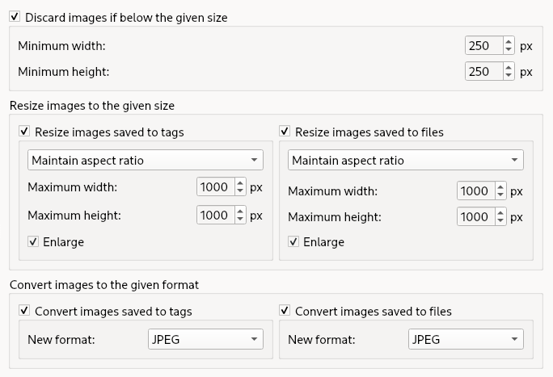

.. MusicBrainz Picard Documentation Project

:index:`Cover Art Processing <pair: configuration; cover art>`
==============================================================

Picard can filter and process the images downloaded from the providers. Image processing can differentiate between images embedded into tags and images saved as a separate file. More filters and processors can be added by `plugins <https://picard.musicbrainz.org/plugins/>`_.

**Discard images if below the given size**

   This filter will discard any image with its width or its height lower than the given values. With some providers, like the Cover Art Archive, the image is discarded before it is downloaded.

**Resize images to the given size**

   Images can be scaled to the given dimensions. You can also choose whether to allow images to increase in size, though at a loss of image quality. There are a few options as to how images are resized:

   * **Maintain aspect ratio**: Scale the source image so that it fits within the target dimensions. One of the final image dimensions may be less than the target dimension if the source image and target dimensions have different aspect ratios.

   * **Scale to width**: Scale the width of the source image to the target width while keeping aspect ratio.

   * **Scale to height**: Scale the height of the source image to the target height while keeping aspect ratio.

   * **Crop to fit**: Scale the source image so that it completely fills the target dimensions in both directions. If the source image and target dimensions have different aspect ratios, then there will be overflow in one direction which will be (center) cropped.

   * **Stretch to fit**: Stretch the image to exactly fit the specified dimensions, distorting it if necessary.

**Convert images to the given format**

   Images can be converted to the given format. The available formats are JPEG, PNG, WebP, and TIFF.

**Processed image quality**

   When images are processed and saved to JPEG or WebP format, you can set the processing quality. The quality factor must be in the range 0 to 100. Specify 0 to obtain small compressed files, 100 for large uncompressed files.
