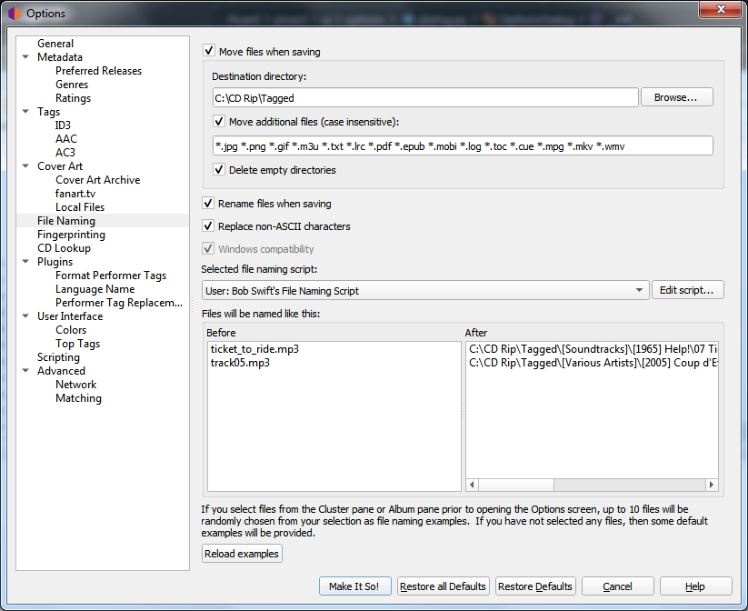

.. MusicBrainz Picard Documentation Project

.. _opt_file_naming:

:index:`File Naming Options <pair: configuration; file naming>`
================================================================

These options determine how Picard handles files when they are saved with updated metadata.

**Move files when saving**

   If selected, this option tells Picard to move your audio files to a new directory when it saves
   them. One use for this is to keep your work organized: all untagged files are under "Directory A",
   and when Picard tags them it moves them to "Directory B". When "Directory A" is empty, your
   tagging work is done.

   If this option is left unchecked, then Picard will leave the files in the same directory when they
   are saved.

   .. note::

      The "Rename Files" and "Move Files" options are independent of one another. "Rename Files"
      refers to Picard changing file names, typically based on artist and track names. "Move Files" refers
      to Picard moving files to new directories, based on a specified parent directory and subdirectories,
      typically based on album artist name and release title. However, they both use the same "file naming
      string". "Move files" uses the portion up until the last '/'. "Rename files" uses the portion after
      the last '/'.

**Destination directory**

   This specifies the destination parent directory to which files are moved when they are saved, if the
   "Move files when saving" option is selected.  If you use the directory "." the files will be moved
   relative to their current location. If they are already in some sort of directory structure, this will
   probably not do what you want!

**Move additional files**

   Enter patterns that match any other files you want Picard to move when saving music files (e.g.:
   "Folder.jpg", "\*.png", "\*.cue", "\*.log"). Patterns support the Unix shell-style wildcards, and are
   separated by spaces. The wildcard patterns available are:

   =========== ===================================
   **Pattern** **Meaning**
   =========== ===================================
   \*          matches everything
   ?           matches any single character
   \[seq\]     matches any character in *seq*
   \[!seq\]    matches any character not in *seq*
   =========== ===================================

   For a literal match, wrap the meta-characters in brackets. For example, '\[?\]' matches the character '?'.

   When these additional files are moved they will end up in the release directory
   with your music files. In a pattern, the '\*' character matches zero or more characters. Other text,
   like ".jpg", matches those exact characters. Thus "\*.jpg" matches "cover.jpg", "liner.jpg", "a.jpg",
   and ".jpg", but not "nomatch.jpg2".

   .. note::

      This option can also be used to move subdirectories to the new release directory.  This is done by
      specifying the name of the subdirectory in the list of files to be moved. For example, if your album
      folders have a subfolder called "Artwork", "covers" or "scans" that contains additional image files
      that you also want to move to the new release directory, simply add "artwork", "covers" and "scans"
      to the list of additional file matching patterns.

**Delete empty directories**

   When selected, Picard will remove directories that have become empty once a move is completed. Leave
   this unchecked if you want Picard to leave the source directory structure unchanged. Checking this box
   may be convenient if you are using the "move files" option to organize your work. An empty directory has
   no more work for you to do, and deleting the directory makes that clear.

**Rename files when saving**

   Select this option to let Picard change the file and directory names of your files when it saves
   them, in order to make the file and directory names consistent with the new metadata.

**Replace non-ASCII characters**

   Select this option to replace non-ASCII characters with their ASCII equivalent (e.g.: 'á', 'ä' and 'ǎ'
   with 'a'; 'é', 'ě' and 'ë' with 'e'; 'æ' with "ae"). More information regarding ASCII characters can be
   found on `Wikipedia <https://en.wikipedia.org/wiki/ASCII>`_.

**Windows compatibility**

   This option tells Picard to replace all Windows-incompatible characters with an underscore. This is
   enabled by default on Windows systems, with no option to disable.

**Allow paths longer than 259 characters**

   This option allows the user to disable the 259 character path limit Picard would usually enforce in Windows
   compatibility mode when renaming and/or moving files. This is possible both on Windows and on other platforms
   with Windows compatibility enabled.

   .. warning::

      Enabling long paths on Windows might cause files being saved with path names exceeding the 259 character
      limit traditionally imposed by the Windows API. Some software might not be able to properly access those files.
      In particular Windows Explorer cannot rename files with long path names or create new files inside folders if
      the resulting path length would exceed the length limit.

**Selected file naming script**

   As of Picard version 2.7, multiple file naming scripts are supported.  This option allows the user to select the
   file naming script to use from the list of scripts available. Scripts can be either system preset scripts or
   user-defined scripts. The available scripts are managed in the :doc:`File naming script editor <options_filerenaming_editor>`
   screen, which is displayed when the :guilabel:`Edit script...` button is selected.

**Files will be named like this**

   Below the file naming script selector is a section showing examples of the output of the script in two columns: Before
   and After.  If you select files from the Cluster pane or Album pane prior to opening the Options screen, up to 10 files
   will be randomly chosen from your selection as file naming examples.  If you have not selected any files, then some default
   examples will be provided.

   You can change the randomly selected example files from your selected files list by clicking on the :guilabel:`Reload examples`
   button.

.. note::

   Any new tags set or tags modified by the file naming script will not be written to the output files' metadata.

.. only:: html

   .. seealso::

      :doc:`options_filerenaming_editor`

.. toctree::
   :hidden:

   options_filerenaming_editor.rst
