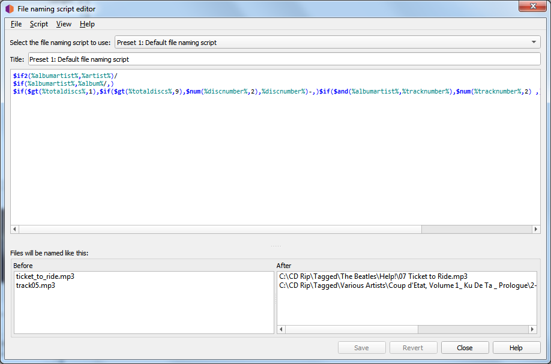

.. MusicBrainz Picard Documentation Project

:index:`File Naming Script Editor <pair: file naming; script editor>`
==================================================================================

The file naming script editor is used to manage the file naming scripts available for use by Picard.
Each script has a title that will show up in the script selection box.  There are two types of scripts
available:

* Preset Scripts - These are basic default scripts provided by Picard.
* User-Defined Scripts - These are scripts that have been defined or customized by the user.

Preset scripts cannot be modified, but you can make a copy of the script and the copy can be edited.

The editor screen has the following sections:

**Select the file naming script to use**

   This option allows the user to select the file naming script to use from the list of scripts available.
   The selected script will show up in the editing section, where it can be modified if it is a user-defined
   script.

**Title**

   The title assigned to the currently selected script. This can be modified if the script is a user-defined script.

**Script**

   Below the title is an edit box section containing the :index:`formatting string <scripts; file naming>` of the
   selected script. This tells Picard what the new name of the file and its containing directories should be in
   terms of various metadata values. The formatting string is generally referred to as a "file naming script", and
   is in :doc:`Picard's scripting language <../extending/scripting>`.

   The script editor automatically highlights the elements of the script, including
   :doc:`function names <../functions/list_by_type>` and :doc:`tag and variable names <../variables/variables>`.
   Hovering your mouse pointer over one of the highlighted entries will display help information about the
   entry if available.

   Unicode characters can be entered into the script using the format ``\uXXXX`` where "XXXX" is the hexadecimal
   value of the unicode character.  It is not recommended to include unicode characters in the directory or filename.

   The use of a '/' in the formatting string separates the output directory from the file name. The formatting string
   is allowed to contain any number of '/' characters. Everything before the last '/' is the directory location, and
   everything after the last '/' becomes the file's name.

   Each file naming script can vary from a simple one-line script such as ``%album%/%title%`` to a very complex script
   using different file naming formats based on different criteria. In all cases, the files will be saved using the text
   output by the script.

   Scripts are often discussed in the `MetaBrainz Community Forum <https://community.metabrainz.org/>`_,
   and there is a thread specific to `file naming and script snippets
   <https://community.metabrainz.org/t/repository-for-neat-file-name-string-patterns-and-tagger-script-snippets/2786/>`_.

   .. note::

      Any new tags set or tags modified by the file naming script will not be written to the output files' metadata.

**Files will be named like this**

   Below the file naming script is a section showing examples of the output of the script in two columns: Before
   and After.  If you select files from the Cluster pane or Album pane prior to opening the Options screen, up to 10 files
   will be randomly chosen from your selection as file naming examples.  If you have not selected any files, then some default
   examples will be provided.

**Menu bar**

   At the top of the screen is a menu bar that provides script management functions as well as display settings options. The
   display settings include:

   * Word wrap script - This will toggle word wrap on and off in the script edit box.
   * Show help tooltips - This will determine whether or not the information is displayed when hovering over a highlighted item.
   * Show documentation - This will toggle displaying the scripting documentation in a sidebar on the screen.

   There is also an option to update the randomly selected example files from your selected files list.

   The script management functionality includes:

   * Import a new script from a file, either as a plain-text script or a Picard Naming Script Package.
   * Export the current script to a file, either as a plain-text script or a Picard Naming Script Package.
   * Add a new (empty) script.
   * Copy the current script as a new script.
   * Delete the current script.
   * Save changes to the current script.
   * Revert the current script to the last time it was saved.

   There is also an option to edit the metadata details for the current script. These details include such things as title,
   author, version, license, description, and date and time of the last update. It is recommended that the description
   include things such as any required plugins, settings, or tagging scripts.

   .. image:: images/options-filenaming-editor-metadata.png
      :width: 100 %

   This information is saved in the Picard Naming Script Package file, and is included when a script package file is imported.
