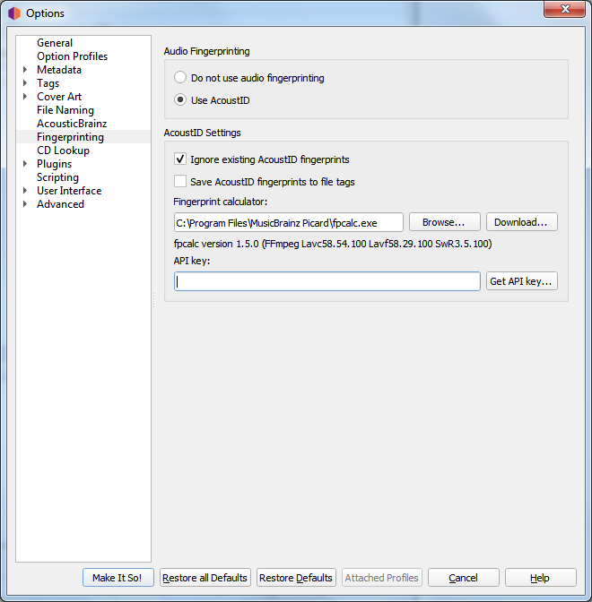

.. MusicBrainz Picard Documentation Project

:index:`Fingerprinting Options <configuration; fingerprinting>`
================================================================

If you select a file or cluster in the left-hand side of the Picard screen and select :menuselection:`"Tools
--> Scan"`, Picard will invoke a program to scan the files and produce a fingerprint for each that can then
be used to look up the file on MusicBrainz.

MusicBrainz currently supports only `AcoustID <https://musicbrainz.org/doc/AcoustID>`_ (an Open Source
`acoustic fingerprinting <https://musicbrainz.org/doc/Fingerprinting>`_ system created by `Lukáš Lalinský
<https://oxygene.sk/>`_) but has previously supported TRM and MusicID PUID.

**Audio Fingerprinting**

   This allows you to select whether or not to enable acoustic fingerprinting within Picard.
   If acoustic fingerprinting is disabled then all remaining options in this tab will be locked and
   ignored.

**Ignore existing AcoustID fingerprints**

   When checked, any existing AcoustID fingerprint information will not be used, and the files will be
   rescanned.

**Save AcoustID fingerprints to file tags**

   When checked, the AcoustID fingerprint information from scanned files will be saved to the ``acoustid_fingerprint``
   tag.  Note that this option is disabled by default because the fingerprint can always be calculated again from
   the audio file, and it can add a rather long data tag to the file.  The option to save this information has been
   added as of Picard v2.7 to accommodate use cases such as a workflow where the user adds this tag directly after
   ripping to avoid having to redo the calculation in the future.

**Fingerprint calculator**

   This identifies the external program on your system that will be used to calculate the AcoustID
   fingerprints.  By default, Picard uses the `Chromaprint <https://acoustid.org/chromaprint>`_ (:program:`fpcalc`)
   utility which is included with the Picard installation.

   Picard will auto-detect the path unless you have specifically overwritten it with something different
   than the detected path. :menuselection:`"Options --> Fingerprinting"` will show the auto detected
   path as a placeholder hint in the text input, and also uses it for validating the executable. The user
   only needs to actually select something if auto detection does not work. If the user has selected a
   specific path this will be used.

**API key**

   The key used to access the AcoustID API to lookup and submit AcoustID fingerprints.  There is no
   cost to obtain an API key.
