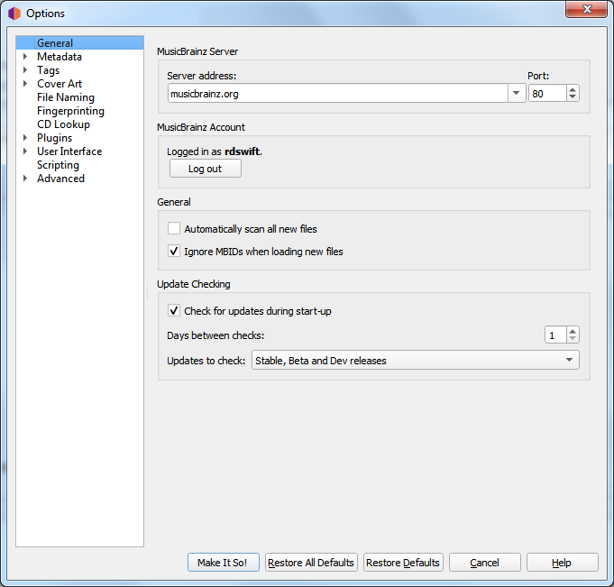

.. MusicBrainz Picard Documentation Project

:index:`General Options <configuration; general options>`
=========================================================

**Server address**

   The domain name for the MusicBrainz database server used by Picard to get details of your music. Default value: musicbrainz.org (for the main MusicBrainz server).

   In addition to the standard MusicBrainz servers provided in the drop down list, you can manually enter an alternate address, such as "localhost" if you are running a local copy of the server. When an alternate server host name is entered, a warning will be displayed and you will be asked to confirm that you want to submit all data to this alternate server.

   .. image:: images/options-alternate-server-confirmation.png
      :width: 100 %

**Port**

   The port number for the server. Default value: 443 (for the main MusicBrainz server).

**Username**

   Your MusicBrainz website username, used to submit acoustic fingerprints, retrieve and save items to your collections, and retrieve personal folksonomy tags.

**Password**

   Your MusicBrainz website password.

**Automatically scan all new files**

   Check this box if you want Picard to scan each music file you add and look for an :index:`AcoustID <pair: AcoustID; automatic scan>` fingerprint. This takes time, but may be helpful for you and MusicBrainz. Leave it unchecked if you don't want Picard to do this scan automatically. In any case, you can direct Picard to scan a particular music file at any time using :menuselection:`"Tools --> Scan"`. See also :ref:`Scan Files <ref_scan_files>` and :ref:`ref_tutorial_acoustid`.

**Automatically cluster all new files**

   Check this box if you want Picard to automatically group all loaded files into album :index:`clusters <pair: cluster; automatic clustering>`. Leave it unchecked if you don't want Picard to do this automatically. In any case, you can direct Picard to cluster files any time using :menuselection:`"Tools --> Cluster"`. See also :ref:`Lookup Files <ref_lookup_files>`.

.. note::

   You can either enable "Automatically scan all new files" or "Automatically cluster all new files", but not both.

**Ignore MBIDs when loading new files**

   If you enable this option Picard will not use MusicBrainz identifiers (MBIDs) stored in the files to automatically load the corresponding MusicBrainz release and match the loaded file to the correct track. Leaving this option disabled is useful when re-processing files that have been previously tagged with incorrect information.

**Check for plugin updates during start-up**

   This option determines whether or not Picard will automatically check for :index:`plugin updates <pair: configuration; plugin update checking>` during startup. If this is enabled and an update to an installed plugin is available, a popup message will be displayed.

**Check for program updates during start-up**

   This option determines whether or not Picard will automatically check for :index:`program updates <pair: configuration; program update checking>` during startup. In any case, you can have Picard check for program updates at any time using :menuselection:`"Help --> Check for update"`.

**Days between checks**

   This option allows you to limit the automatic program update checking by selecting the interval, in days, between checks. Set this to 1 if you want to check daily, 7 for weekly checks, and so on. Note that this only applies if the "Check for program updates during start-up" option is enabled.

**Updates to check**

   This option allows you to select which levels of program update to check. Your options are:

   * Stable releases only
   * Stable and Beta releases
   * Stable, Beta and Dev releases

   For example, if you subscribe to "Stable releases only" you will not be notified if a new Beta or Dev release is issued.

.. note::

   The program update checking related settings and :menuselection:`"Help --> Check for update..."` command may not be available when Picard is distributed as a package. In that case, the user should check with the maintainer of the package to determine when an update is available.
