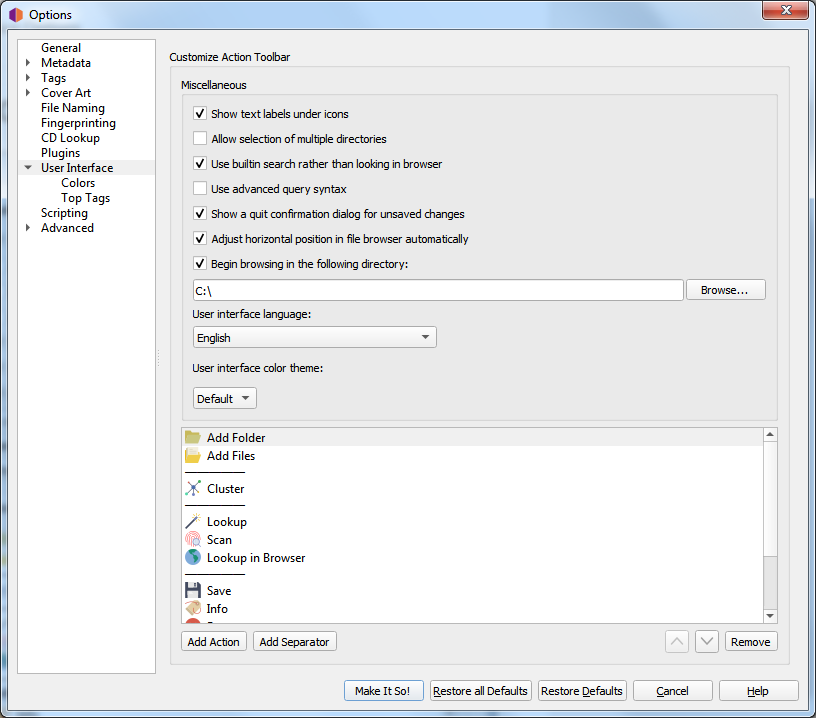

.. MusicBrainz Picard Documentation Project

:index:`User Interface Options <pair: configuration; user interface>`
======================================================================

**Show text labels under icon**

    If this option is disabled, the text labels under the icons in the toolbar will not be displayed,
    causing the toolbar to appear a little smaller.

**Show icons in menus**

    Some users prefer to disable menu icons, which is the default behavior for macOS systems. This option
    allows the user to select whether the icons are displayed in the menus.

**User interface language**

    By default, Picard will display in the language displayed by your operating system, however you can
    override this and select a different language if needed.

**User interface color theme**

    This option allows the user to select the color theme used by Picard. On macOS and Windows systems, the available choices are:

    * Default - The default color scheme based on the operating system display settings.
    * Light - A light display theme.
    * Dark - A dark display theme.

    On Linux and similar operating systems, the available choices are:

    * Default - The default color scheme based on the operating system display settings.
    * System - The Qt5 theme configured in the desktop environment.

    .. note::

        The colors for the light and dark themes can be customized in the :doc:`options_interface_colors` section.  Separate sets of
        color selections are maintained for the light and dark themes.  The colors for the currently displayed theme are the ones
        displayed for editing.

**Allow selection of multiple directories**

    Enabling this option will bypass the native directory selector and use Qt's file dialog.  This
    may be desirable since the native directory selector generally doesn't allow you to select more
    than one directory. This applies to the :menuselection:`"File --> Add folder"` dialog. The file
    browser always allows multiple directory selection.

**Use built-in search rather than looking in browser**

    When this option is enabled the search for albums, artists or tracks will show the results in a dialog.
    By default this option is enabled. If this option is disabled Picard will open a search on
    MusicBrainz.org in your default web browser.

**Use advanced query syntax**

    This will enable advanced query syntax parsing on your searches. This only applies to the search
    box at the top right of Picard, not the lookup buttons.

**Show a quit confirmation dialog for unsaved changes**

    When this is enabled, Picard will show a dialog when you try to quit the program with unsaved
    files loaded. This may help prevent accidentally losing tag changes you've made, but not yet saved.

**Adjust horizontal position in file browser automatically**

    When this is enabled, Picard will automatically scroll the file browser display to keep relevant content visible.

**Begin browsing in the following directory**

    By default, Picard remembers the last directory used to load files. If you enable this option
    and provide a directory, Picard will always start in the directory provided.

**Customize action toolbar**

    This allows you to to add, remove or rearrange the items displayed in the Action Toolbar.

.. only:: html and not epub

   .. seealso::

      Details:
      :doc:`options_interface_colors` /
      :doc:`options_interface_top_tags`

.. toctree::
   :hidden:

   options_interface_colors
   options_interface_top_tags
