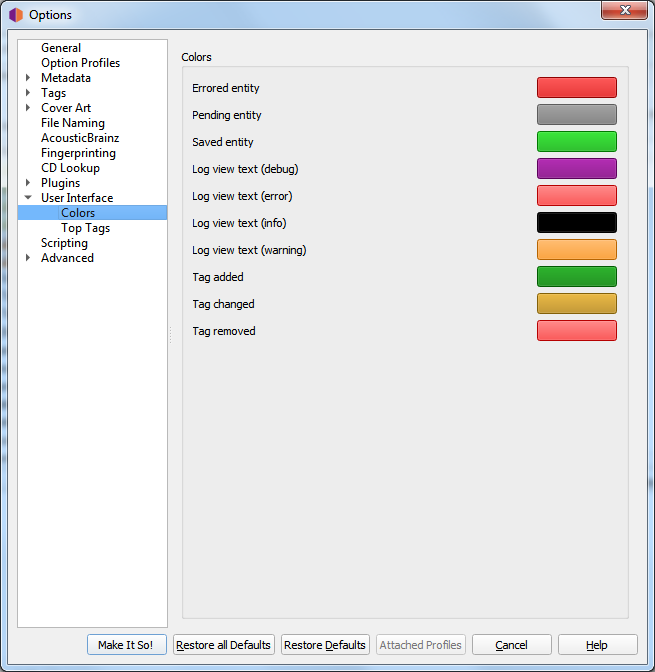

.. MusicBrainz Picard Documentation Project

:index:`Colors <configuration; colors, user interface; colors>`
===============================================================

This section allows you to customize the various colors used in the Picard user interface. To change a color, simply click on the color block currently displayed for the desired text condition to bring up a selection dialog, then pick your desired color. The colors can be changed for the following text conditions:

* **Errored entity**: files and other elements with errors on loading or saving

* **Pending entity**: files and other elements queued up for processing

* **Saved entity**: successfully saved files

* **Log view text (debug)**: debug messages in the Error/Debug Log

* **Log view text (error)**: error messages in the Error/Debug Log

* **Log view text (info)**: informational messages in the Error/Debug Log

* **Log view text (warning)**: warning messages in the Error/Debug Log

* **Tag added**: newly added tags in the metadata pane

* **Tag changed**: changed tags in the metadata pane

* **Tag removed**: removed tags in the metadata pane

.. note::

   Separate sets of color selections are maintained for the light and dark themes. The colors for the currently displayed theme are the ones displayed for editing.
