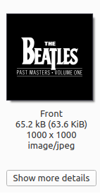
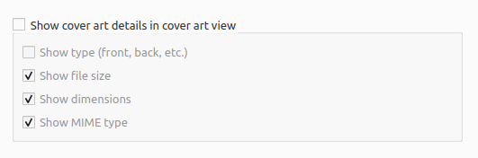

.. MusicBrainz Picard Documentation Project

:index:`Cover Art Box <configuration; cover art box>`
=================================================================

Picard version 3 introduced the ability to display selected details in the Coverart section without having to specifically click :guilabel:`Show more details`, such as:

----

The user can select which details appear in this section.

