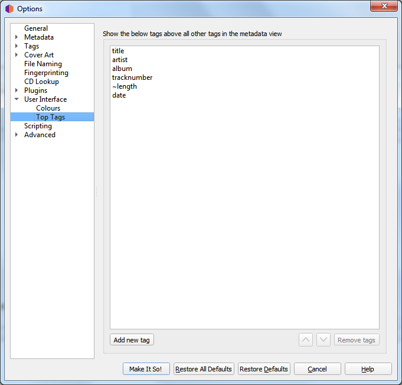

.. MusicBrainz Picard Documentation Project

:index:`Top Tags <configuration; top tags>`
============================================

The tags specified in this option setting will always be shown in the specified order at the top of the
metadata pane (which shows the metadata of selected files or tracks).
This allows you to have the most important tags always on top of the list. Tags not listed here will be shown
in alphabetical order below the top tags.

.. note::

   By default, Picard will display the tags "**Title**", "**Artist**", "**Album**", "**Track Number**", "**Length**"
   and "**Date**" first in the list. This can be changed if you right click on one of the tags in the metadata pane,
   and enable :menuselection:`"Show Changes First"` in the context menu.

   .. image:: images/options-interface-top-tags-context.png
