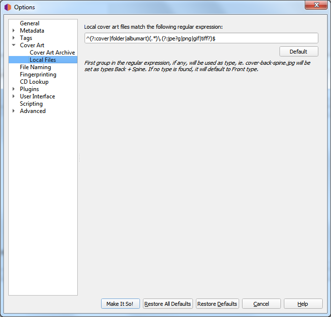

.. MusicBrainz Picard Documentation Project

.. _ref-local-files:

:index:`Local Files <configuration; local files>`
=================================================

In this section you can configure the file names to be used by the Local Files cover art provider. If you are trying to collect more than one image, the naming is important.

The file names are defined using a `regular expression <https://en.wikipedia.org/wiki/Regular_expression>`_. The default is ``^(?:cover|folder|albumart)(.*)\.(?:jpe?g|png|gif|tiff?)$`` which will load files with the name "cover", "folder" or "albumart" and the file extension "jpg", "png", "gif" or "tiff" (e.g.: "folder.jpg" or "cover.png").

The first part of the regular expression is a non-capture group: ``(?:cover|folder|albumart)``. Items listed in this group will not get captured and the default (Front) type will apply.

The second part of the regular expression is a group: ``(.*)``. This is the real capture, so if the file names match any of the cover art types, they will be tagged as such.

.. note::

   A common mistake is to add all the types into the first (non-capture) group. This means that all the regular file names would be thrown into the Front type and cause unexpected results.
