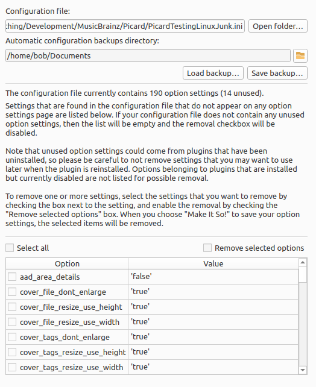

.. MusicBrainz Picard Documentation Project

:index:`Maintenance <configuration; maintenance>`
=================================================

**Configuration File**

   This displays the path and file name of the configuration INI file currently used by
   Picard. This file contains all of your settings and preferences, and the format of the
   file is consistent across operating systems.

   The :guilabel:`Save Backup` button allows you to create a backup copy of the current
   configuration file.  This can be used to easily copy the settings for use on a different
   computer, or to provide a snapshot for easy recovery in the event that the configuration
   becomes corrupted or you want to undo configuration changes.  It also allows you to have
   different configurations available without using profiles.

   The :guilabel:`Load Backup` button allows you to replace the current configuration file
   with a backup created earlier.  Loading a backup configuration file will replace all of
   the current configuration settings.  Prior to loading the file, Picard will automatically
   save a backup copy of the current file.

**Configuration File Cleanup**

   Over the course of trying out plugins and such, the configuration INI file can become
   bloated with orphaned settings.  This section allows you to remove unused option settings
   from the configuration INI file.

   Settings that are found in the configuration file that do not appear on any option
   settings page will be listed. If your configuration file does not contain any unused
   option settings, then the list will be empty and the removal checkbox will be
   disabled.

   To remove one or more settings, first enable the removal by checking the "Remove
   selected options" box. You can then select the settings to remove by checking the
   box next to the setting. When you choose :guilabel:`Make It So!` to save your option
   settings, the selected items will be removed.

   .. note::

      Unused option settings could come from plugins that have been uninstalled,
      so please be careful to not remove settings that you may want to use later when
      the plugin is reinstalled. Options belonging to plugins that are installed but
      currently disabled will not be listed for possible removal.
