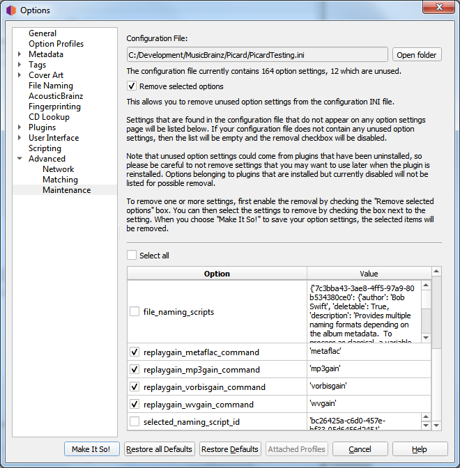

.. MusicBrainz Picard Documentation Project

:index:`Maintenance <configuration; maintenance>`
=================================================

Over the course of trying out plugins and such, the configuration INI file can become
bloated with orphaned settings.  This section allows you to remove unused option settings
from the configuration INI file.

Settings that are found in the configuration file that do not appear on any option
settings page will be listed. If your configuration file does not contain any unused
option settings, then the list will be empty and the removal checkbox will be
disabled.

To remove one or more settings, first enable the removal by checking the "Remove
selected options" box. You can then select the settings to remove by checking the
box next to the setting. When you choose :guilabel:`Make It So!` to save your option
settings, the selected items will be removed.

.. note::

   Unused option settings could come from plugins that have been uninstalled,
   so please be careful to not remove settings that you may want to use later when
   the plugin is reinstalled. Options belonging to plugins that are installed but
   currently disabled will not be listed for possible removal.
