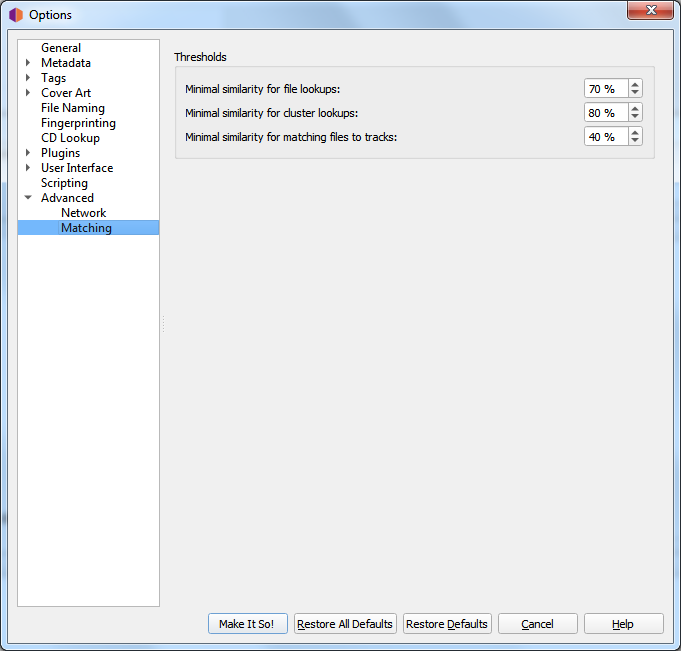

.. MusicBrainz Picard Documentation Project

:index:`Matching <configuration; matching preferences>`
========================================================

It is recommended for most users to leave these settings at their default values. For advanced users,
these allow you to tune the way Picard matches your files and clusters to MusicBrainz releases
and tracks.

**Minimal similarity for file lookups**

    The higher the percentage value, the more similar an individual file's metadata must be to the
    metadata from MusicBrainz for it to be matched to a release on the right-hand side.

    This setting is used when you do a lookup on individual files. The files' metadata is compared to
    the recordings found on MusicBrainz. If the similarity is below the threshold the recording is
    ignored completely.

**Minimal similarity for cluster lookups**

    The higher the percentage value, the more similar a cluster of files from the left-hand pane must
    be to a MusicBrainz release for the entire cluster to be matched to a release on the right-hand
    side.

**Minimal similarity for matching files to tracks**

    The higher the percentage value, the more similar an individual file's metadata must be to the
    metadata from MusicBrainz for it to be matched to a release on the right-hand side.

    This setting is used when a file is assigned to a release and Picard needs to decide which track
    to assign it to. This happens on cluster lookup after the release has been chosen, or if you
    manually drag files onto a loaded release (as opposed to dragging it onto a track directly). If
    none of the tracks gives a match above the threshold the file is moved into an "unmatched files"
    section on that release.

If you have absolutely no metadata in your current files, and you are using "Scan" to match tracks,
you may find that you need to lower the value of "Minimal similarity for matching files to tracks"
in order for Picard to match the files within a release. Otherwise you may find that Picard matches
the track to a release but then is not sure which track is correct; and leaves it in an "unmatched
files" group within that release.

As a general rule, lowering the percentages may increase the chance of finding a match at the risk of
false positives and incorrect matches.
