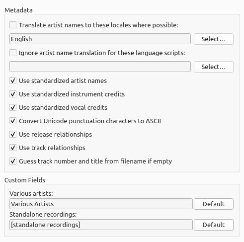

.. MusicBrainz Picard Documentation Project

:index:`Metadata Options <configuration; metadata options>`
============================================================

**Translate artist names to this locale where possible**

   When checked, Picard will see whether an artist has an alias for the selected locale. If it does, Picard will use that
   alias instead of the artist name when tagging. When "English" is the selected locale, the artist sort name (which is,
   by Style Guideline, stored in Latin script) is used as a fallback if there is no English alias.

**Use standardized artist names**

   Check to only use standard Artist names, rather than Artist Credits which may differ slightly across tracks and releases.

   .. note::

      If the "Translate artist names" option above is also checked, it will override this option if a suitable alias is found.

**Use standardized instrument and vocal credits**

   Check to only use standard names for instruments and vocals in performer relationships. Uncheck to use the instruments
   and vocals as credited in the relationship.

**Convert Unicode punctuation characters to ASCII**

   Converts Unicode punctuation characters in MusicBrainz data to ASCII for consistent use of punctuation in tags. For example,
   right single quotation marks are converted to ASCII apostrophes ('), and horizontal ellipses are converted to three
   full stops (...).

**Use release relationships**

   Check to retrieve and write release-level relationships (e.g.: URLs, composer, lyricist, performer, conductor, or DJ mixer)
   to your files. You must have this enabled to use Picard to retrieve cover art.

**Use track relationships**

   Check to write track-level relationships (e.g.: composer, lyricist, performer, or remixer) to your files.

**Guess track number and title from filename if empty**

   If checked, Picard will try to guess a file's track number or title from the filename if the ``tracknumber``
   or ``title`` tag is empty.

**Various artists**

   Choose how you want the "Various Artists" artist spelled.

**Non-album tracks**

   Choose how you want "non-album tracks" to be grouped.

.. only:: html

   .. seealso::

      Details:
      :doc:`options_releases` /
      :doc:`options_genres` /
      :doc:`options_ratings`

.. toctree::
   :hidden:

   options_releases
   options_genres
   options_ratings
