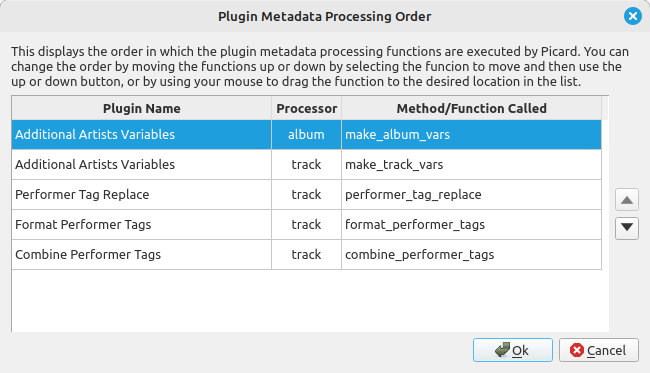

.. MusicBrainz Picard Documentation Project

:index:`Plugin Execution Order <configuration; plugin execution order>`
=======================================================================

Each plugin that works with an album or track's metadata has their various processing functions registered with an execution priority set by the plugin author within the plugin itself. A plugin may contain multiple different processing functions, each with its own specified priority. These priorities determine the order in which the functions are executed, and are generally set as HIGH, NORMAL or LOW.

Most of the time this grouping of execution priorities is sufficient, however there may be a situation where one plugin processing function must be executed before another plugin function with the same priority in order to avoid unintended results. This option setting allows you to specify the order that the plugin metadata processing functions are executed, regardless of the initial registered priority for the function. In this way, you can avoid unexpected results that might otherwise occur.

When the execution order editor is opened, it will display all of the enabled plugin metadata processing functions in the order in which they are executed by Picard. You can change the order by moving the plugin processing functions up or down by selecting the function to move and then use the up or down button, or by using your mouse to drag the function to the desired location in the list.

.. note::

   Hovering your cursor over a plugin's name will display a description of the function, and hovering over a plugin's processing function will display a description of the function if available.
