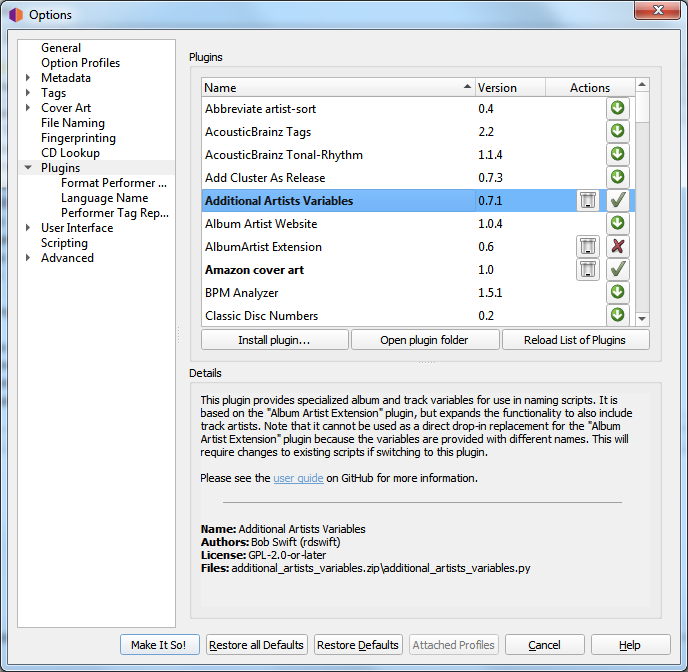
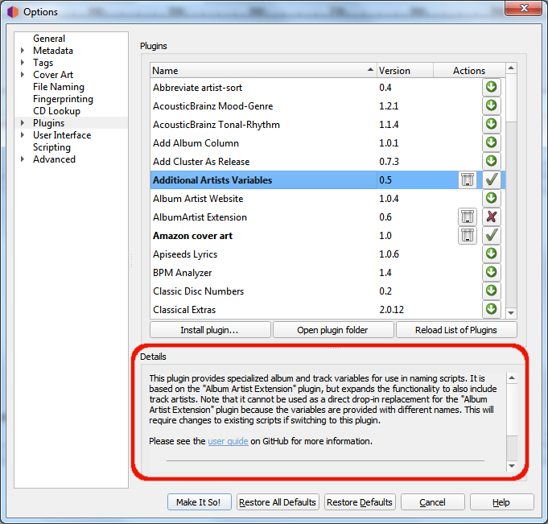

.. MusicBrainz Picard Documentation Project
.. Prepared in 2020 by Bob Swift (bswift@rsds.ca)
.. This MusicBrainz Picard User Guide is licensed under CC0 1.0
.. A copy of the license is available at https://creativecommons.org/publicdomain/zero/1.0

Plugins Options
===============

.. index::
   pair: configuration; plugins

This section allows you to manage the plugins used by Picard.  You can install new plugins or enable,
disable or uninstall plugins that are currently installed.  Picard provides a list of plugins that have
been submitted to the project.  A list of the standard plugins is available on the `plugins page
<https://picard.musicbrainz.org/plugins/>`_ on the Picard website.

.. index::
   single: plugins; third-party

There are also a number of plugins available by third-party developers.  Often these are discussed on
the `Community Discussion Forum <https://community.metabrainz.org/>`_ so if you're looking for a particular
enhancement or functionality, a search there might be useful.  In addition, one of the MusicBrainz editors,
`Colby Ray <https://wiki.musicbrainz.org/User:Colbydray>`_ maintains an unofficial list of available
plugins on a `wiki page <https://wiki.musicbrainz.org/User:Colbydray/PicardPlugins>`_.  Instructions regarding
installation of third-party plugins are included in the :ref:`"Installing Third-Party Plugins" <ref_installingplugins>`
section below.

Plugins List
------------

The screen displays a list of the standard plugins and any others that have been installed.  Each plugin is
displayed on a separate line showing the version number and one or more status / action icons.  The icons are:

.. |img-plugin-download| image:: images/options-plugin-download.png
   :width: 18pt
   :height: 18pt

|img-plugin-download|

   | This icon indicates that the plugin is not installed.  Clicking the icon will download and install the plugin.
   |

.. |img-plugin-reload| image:: images/options-plugin-reload.png
   :width: 18pt
   :height: 18pt

|img-plugin-reload|

   | This icon indicates that a newer version of the plugin is available.  Clicking the icon will download and install the updated version.
   |

.. |img-plugin-enabled| image:: images/options-plugin-enabled.png
   :width: 24pt
   :height: 24pt

|img-plugin-enabled|

   | This icon indicates that the plugin is installed and currently enabled.  Clicking the icon will disable the plugin, but it will still be installed.
   |

|img-plugin-disabled|

   | This icon indicates that the plugin is installed but currently disabled.  Clicking the icon will enable the plugin.
   |

.. |img-plugin-trash| image:: images/options-plugin-trash.png
   :width: 24pt
   :height: 24pt

|img-plugin-trash|

   | This icon indicates that the plugin is currently installed.  Clicking the icon will uninstall the plugin.
   |

When a plugin in the list is selected (i.e.: highlighted), a brief description of the plugin will be shown in  the "Details"
section below the list.

.. note::

   Some plugins have their own option page which will typically appear under the "Plugins" section of the
   Options.

.. _ref_installingplugins:

.. index::
   single: plugins; installing

Installing Third-Party Plugins
------------------------------

You can install a third-party plugin that does not appear in the plugins list, using the following steps:

1. Download the plugin and save it to a local drive.

2. Select the "Install plugin..." action, located just below the list of plugins.

   .. image:: images/install-plugin.png
      :width: 100 %

3. Navigate to the file you downloaded in Step 1 and select it.  The file will be copied to the plugin folder,
   and will appear in the list of plugins.

4. Enable the plugin if desired, and select the "Make It So!" action button at the bottom of the window.
