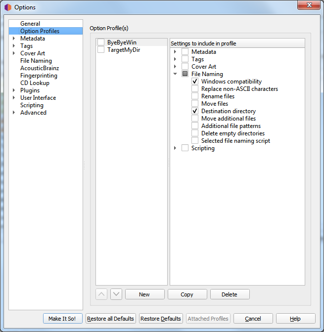

.. MusicBrainz Picard Documentation Project

:index:`Profile Options <configuration; profiles, profiles; option>`
====================================================================

As of version 2.7, Picard supports multiple profiles that can quickly switch between option settings. This page allows for the
management of those user-defined option profiles.

Initially, the list of profiles will be empty.  To create a new profile click on the :guilabel:`New` button.  This will create a
profile with no options selected for the profile to manage.  To rename the profile, right-click on the profile name and
select the :menuselection:`"Rename profile"` command.

The options that the profile is to manage are selected from the list in the right-hand pane.  Options can be selected either by
group or individually.  The groups can be expanded to see the individual options belonging to that group.

The profile stack order can be rearranged either by selecting a profile and using the up and down arrow buttons below the
list, or by dragging the profile to a new position in the stack.  Profiles are enabled when the box beside the profile's name
is checked.

Changes made to a profile's options settings, enabled status, or position in the profile stack will be reflected in the option
settings displayed on the other pages. Options that are controlled by an enabled profile will be shown as highlighted.
Hovering your cursor over the highlighted option will identify which profile currently controls the setting. Settings are
always displayed based on the first enabled profile in the profile stack, which corresponds to the setting that will be used
during processing.

.. warning::

   It is important to understand that when you click the :guilabel:`Make It So!` button **all** of the option settings on **all**
   pages will be saved. If an option is managed by one or more profiles that are currently enabled, the option will be highlighted
   and it will be saved to the **first** enabled profile in the profile stack that manages the option. If there are no enabled
   profiles that manage the option, the option will not be highlighted and it will be saved to the "user settings" profile which
   is the user's normal settings, contains all options, is at the bottom of the profile stack, and is always enabled.  The "user
   settings" profile cannot be modified and is not shown in the profile management page.

.. seealso::

   Please see the :doc:`../usage/option_profiles` section for a detailed explanation of the profile system.
