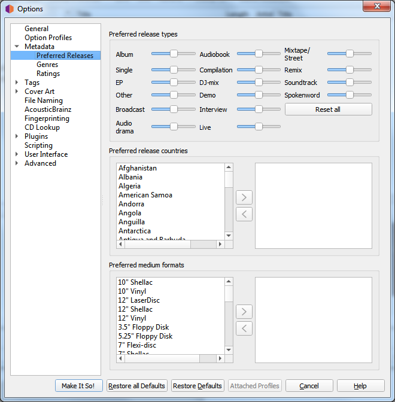

.. MusicBrainz Picard Documentation Project

:index:`Preferred Releases <configuration; release preferences>`
=================================================================

**Preferred release types**

   Adjust the sliders for various release types to tweak how likely Picard is to match a file or cluster to releases of various
   types. For example, you can use this to decrease the likelihood of Picard matching a file or album to a Compilation or Live
   version.

**Preferred release countries**

   Add one or more countries into the list to make Picard prefer matching clusters or files to releases from the chosen countries.
   This list is also used to prioritize files in the "Other Releases" context menu.

**Preferred medium formats**

   Add one or more formats into the list to make Picard prefer matching clusters or files to releases of the specified format.
   This list is also used to prioritize files in the "Other Releases" context menu.
