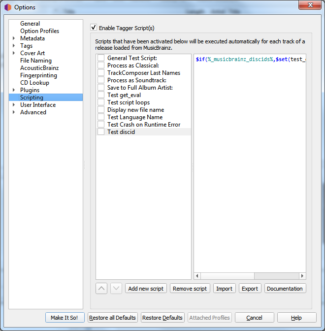

.. MusicBrainz Picard Documentation Project

:index:`Scripting Options <configuration; scripting, scripts; tagging>`
========================================================================

This section allows for the management of user-defined tagging scripts.

The "Tagger Script(s)" checkbox at the top of the page allows you to completely disable all
tagging scripts.  This can be useful when tracking down a problem with Picard's configuration.

Below the checkbox are two columns showing the list of scripts in the left-hand column, with
the content of the selected script shown in the right-hand column.  This section allows you to
add, remove and reorder the scripts, enable or disable individual scripts, as well as edit the
currently selected script.

The script editor automatically highlights the elements of the script, where dark blue text
starting with a '$' is a :doc:`function name <../functions/list_by_type>` and names in light blue
within '%' signs are Picard's :doc:`tag and variable names <../variables/variables>`. Hovering
your mouse pointer over one of the highlighted entries will display help information about the
entry if available.

Unicode characters can be entered into the script using the format ``\uXXXX`` where "XXXX" is
the hexadecimal value of the unicode character.

When the checkbox beside the script is checked, that script will be executed automatically, once
for each track in the release, when Picard retrieves information for a release from the MusicBrainz
website.  If the checkbox is left unchecked, then the script will not be executed automatically.

Regardless of whether or not the script is executed automatically, it can also be executed manually
by right-clicking on an item in the clustering pane (middle pane) or the tagging pane (right-hand
pane) and selecting it from the list displayed when :menuselection:`"Run Scripts"` is selected.  If
a cluster is selected in the middle pane or a release is selected in the right-hand pane, the script
will be executed for each track in the selected cluster or release.  If only a single track or file
is selected, then the script will only be executed for that track or file.

For additional information about scripting please see the ":doc:`Scripts <../extending/scripts>`"
and ":doc:`Scripting <../extending/scripting>`" sections, as well as ":doc:`Tags & Variables <../variables/variables>`".
