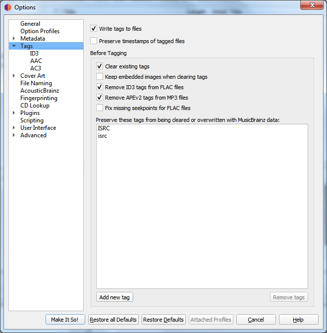

.. MusicBrainz Picard Documentation Project

:index:`Tag Options <configuration; tag options>`
=================================================

**Write tags to files**

   Uncheck to disable Picard from writing metadata to your files. Picard may still move or rename your files according to your settings.

**Preserve timestamps of tagged files**

   If checked, Picard will not update the "Last Modified" date and time of your music files when it writes new tags to them.

**Clear existing tags**

   Checking this will remove all existing metadata and leave your files with only MusicBrainz metadata. Information you may have added through another media player such as "genre", "comments" or "ratings" will be removed.

**Keep embedded images when clearing tags**

   The default is for Picard to remove any embedded images from the files when clearing existing tags. Checking this option will keep the embedded images in the files.

**Remove ID3 tags from FLAC files**

   Check to remove ID3 tags from FLAC files - Vorbis Comments are recommended for FLAC files. Picard will write Vorbis Comments to FLAC files regardless of this setting.

**Remove APEv2 tags from MP3 files**

   Check to remove APEv2 tags from MP3 files - ID3 is recommended for MP3 files. Picard will write ID3 tags to MP3 files regardless of this setting.

**Fix missing seekpoints for FLAC files**

   Some software has issues handling FLAC files that have an empty seek table metadata block. When this option is enabled empty and hence unused seek table blocks will be removed from the files on saving.

**Preserve these tags from being cleared or overwritten with MusicBrainz data**

   This is an advanced option: If you have tags which you need to preserve, enter their names here to stop Picard from overwriting them.

**Do not sanitize dates for these tag formats**

   Normally Picard will sanitize the dates stored in tags. This option allows you to override that sanitization for the selected formats.

.. only:: html and not epub

   .. seealso::

      Details:
      :doc:`options_tags_compatibility_id3` /
      :doc:`options_tags_compatibility_aac` /
      :doc:`options_tags_compatibility_ac3` /
      :doc:`options_tags_compatibility_wave`

.. toctree::
   :hidden:

   options_tags_compatibility_id3
   options_tags_compatibility_aac
   options_tags_compatibility_ac3
   options_tags_compatibility_wave
