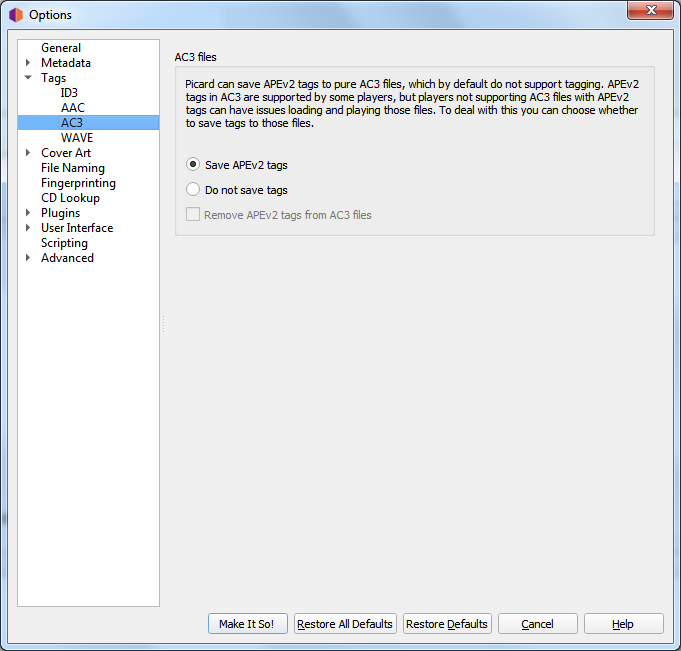

.. MusicBrainz Picard Documentation Project
.. Prepared in 2020 by Bob Swift (bswift@rsds.ca)
.. This MusicBrainz Picard User Guide is licensed under CC0 1.0
.. A copy of the license is available at https://creativecommons.org/publicdomain/zero/1.0

AC3 Files
=========

.. index::
   single: configuration; ac3 tag options

Picard can save APEv2 tags to pure AC3 files, which by default do not support tagging. APEv2 tags in AC3
are supported by some players, but players not supporting AC3 files with APEv2 tags can have issues loading
and playing those files. To deal with this you can choose whether to save tags to those files:

**Save APEv2 tags**

   Picard will save APEv2 tags to the files.

**Do not save tags**

   Picard will not save any tags to the files, but you can still use Picard to rename them.
   By default existing APEv2 tags will be kept in the file.

**Remove APEv2 tags**

   If you have "Do not save tags" enabled checking this option will cause Picard to remove
   existing APEv2 tags from the file on saving.

Regardless of how you have configured saving tags Picard will always read existing APEv2 tags in AC3 files.
