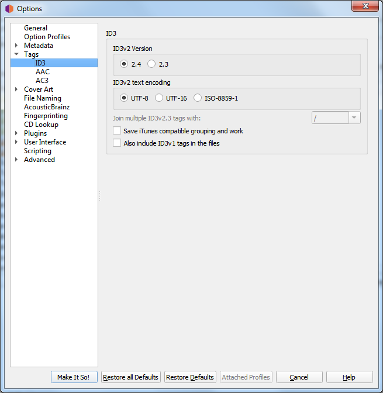

.. MusicBrainz Picard Documentation Project

:index:`ID3 Files <configuration; id3 tag options>`
====================================================

**ID3v2 version**

   Although ID3v2.4 is the latest version, its support in music players is still lacking. While some software has
   no problem using version 2.4 tags, others may not be able to read the tags and display the information. Support
   for ID3v2.4 in other media players (such as smartphones) is variable.

   Other than native support for multi-valued tags in v2.4, the :doc:`Picard Tag Mapping <../appendices/tag_mapping>`
   section will show you what you lose when choosing v2.3 instead of v2.4.

**ID3v2 text encoding**

   The default for version 2.4 is UTF-8, the default for version 2.3 is UTF-16. Use ISO-8859-1 only if you face
   compatibility issues with your player.

**Join ID3v23 tags with**

   As mentioned above, ID3v2.3 does not support multi-value tags, and so Picard flattens these to strings before
   saving them to ID3v2.3 tags. This setting defines the string used to separate the values when flattened. Use
   '; ' for the greatest compatibility (rather than '/' since tags more often contain a '/' than a ';') and for
   the best visual compatibility in Picard between ID3v2.3 and other tagging formats.

   .. note::

      This setting is explicitly only for ID3 v2.3 tags, because those don’t support proper multi value tags.
      Hence this separator thing is actually more of a workaround to this fact.

      Because Vorbis tags allow the same tag to exist multiple times, and hence support multi valued tags by
      default, there actually is no separator at all there. It is just multiple values, shown using whatever the
      player software uses uses as a separator.

      If for some reason you want all the values of the tag in a single field separated by some separator you
      could use a script like:

      ``$set(musicbrainz_artistid,$join(%musicbrainz_artistid%, / ))``

      to flatten all the values into a single field separated by " / ".

**Save iTunes compatible grouping and work**

   Save the tags grouping and work so that they are compatible with current iTunes versions. Without this option
   grouping will be displayed in iTunes as "work name" and work will not be available.

   See the :doc:`Picard Tag Mapping <../appendices/tag_mapping>` section for details.

   .. note::

      For other players supporting grouping and work you might need to disable this option.
      `MusicBee <https://getmusicbee.com/>`_ is one example of this.

**Also include ID3v1 tags in the files**

   This is not recommended at all. ID3v1.1 tags are obsolete and may not work with non-latin scripts.
