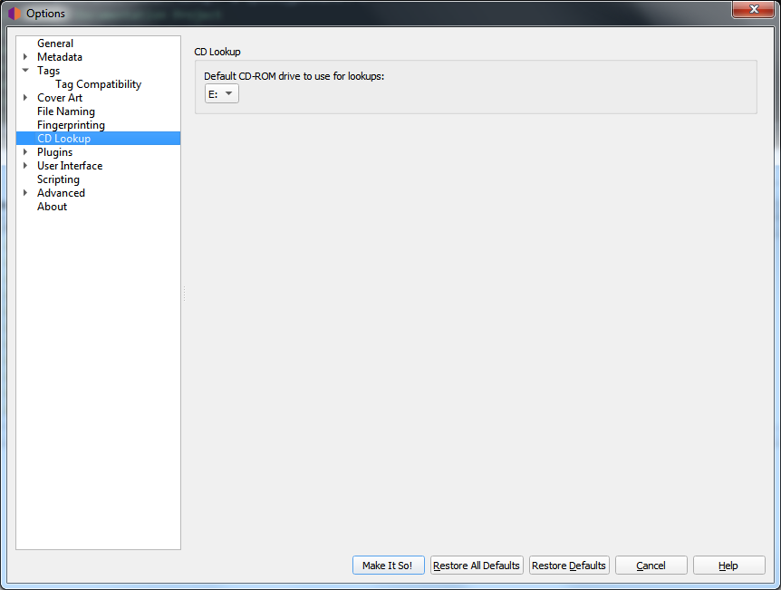

.. MusicBrainz Picard Documentation Project

Windows
=======

On Windows, Picard has a pulldown menu listing the various CD drives it has found. Pull down the menu and select the drive you want to use by default.

You can override this setting by clicking on :menuselection:`"Tools --> Lookup CD..."` and selecting the desired device from the list of available devices.
