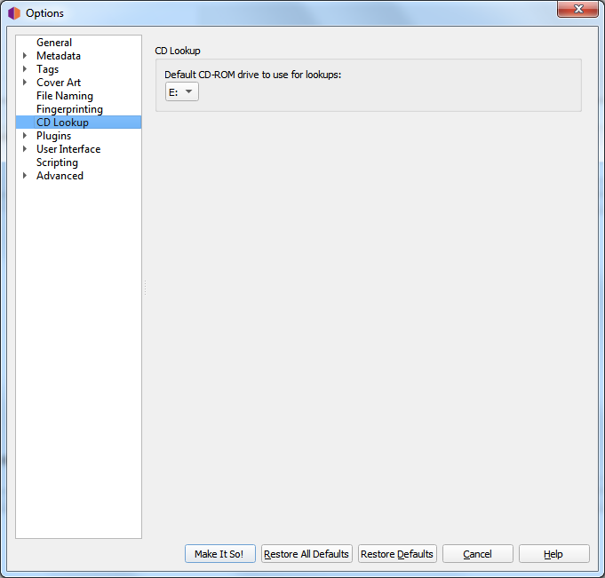

.. MusicBrainz Picard Documentation Project
.. Prepared in 2020 by Bob Swift (bswift@rsds.ca)
.. This MusicBrainz Picard User Guide is licensed under CC0 1.0
.. A copy of the license is available at https://creativecommons.org/publicdomain/zero/1.0

Windows
=======

On Windows, Picard has a pulldown menu listing the various CD drives it has found. Pull down the
menu and select the drive you want to use by default.

You can override this setting by clicking on :menuselection:`"Tools -->
Lookup CD..."` and selecting the desired device from the list of available devices.
