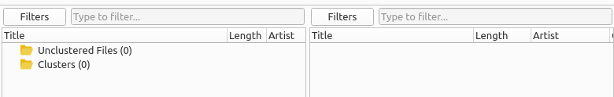

.. MusicBrainz Picard Documentation Project

:index:`Filtering the Main Screen <user interface; main screen filtering>`
===========================================================================

The items displayed in the Cluster Pane and the Album Pane can be filtered to allow for quickly reviewing selected information. The filter bars can be displayed or hidden from the :menuselection:`"View"` menu, or using the keyboard shortcut :kbd:`Ctrl+Shift+F`.

To filter the items in one of the panes, simply select one or more filters and enter the filter text to use for that pane. The items will be displayed or hidden based on the filter criteria entered.

When the :guilabel:`Filters` button is clicked, a dialog will be displayed to allow to you to select the filters to use for that pane.

.. only:: not latex

   .. image:: images/filter_selection_dialog.png

.. only:: latex

   .. image:: images/filter_selection_dialog.png
      :width: 30%

When filtering is applied, items will only be displayed if:

- no filters are selected or no filter text has been entered;
- no tags are found that match the selected filters;
- a tag is found that matches one of the selected filters and the filter text is found within the tag value.

Items will not be displayed if one or more tags were found in the selected filters and the filter text was not found in any values of those tags.
