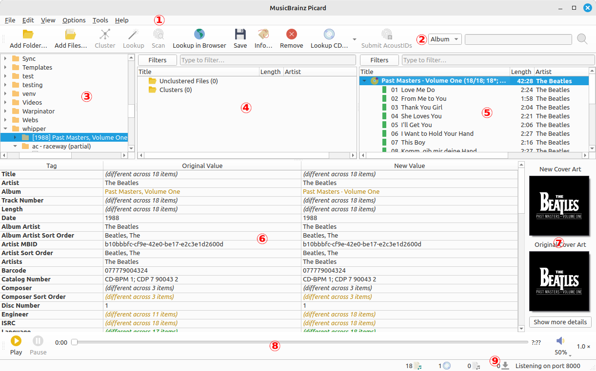
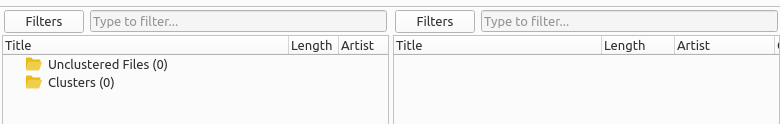

.. MusicBrainz Picard Documentation Project

.. |nl| raw:: latex

   \newline

:index:`Main Screen <user interface; main screen>`
==================================================

.. Picard's main screen is comprised of a number of sections, as described below:

1. **Menu Bar**: This provides the pull-down menu of actions that Picard can perform.

2. **Tool Bar**: This provides quick links to the main functions performed by Picard. This can be customized by the user in the :doc:`User Interface Options <../config/options_interface>` settings.

3. **File Browser**: This provides a browser for selecting files and directories for processing.

4. **Cluster Pane**: Often referred to as the "left-hand pane", this section allows the user to select and cluster files for scanning, lookup or matching.

5. **Album Pane**: Often referred to as the "right-hand pane", this section displays the albums retrieved from MusicBrainz. This is the section where files are matched to downloaded track information.

6. **Metadata Pane**: This section is a three-column table of the tag metadata for the album or track currently selected in the Album Pane. The first column shows the tag name, the second shows the original value found in the file, and the third column shows the new value that will be written.

7. **Cover Art**: This shows the new cover art image that will be written to the selected album or track, along with the original cover art image found in the files matched to the selected album or track.

8. **Player**: The built-in player that can be used to play selected audio files.

9. **Status Bar**: The bar at the bottom of the screen shows information about the current operation of Picard, including such items as number of files, albums, and pending downloads. |nl|

Picard is available for different operating systems. And while Picard's functionality is overall the same the specific look of the user interface can be slightly different based on the operating system.

.. _main_screen_filter:

:index:`Filtering the Main Screen <user interface; main screen filtering>`
--------------------------------------------------------------------------

The items displayed in the Cluster Pane and the Album Pane can be filtered to allow for quickly reviewing selected information. The filter bars can be displayed or hidden from the :menuselection:`"View"` menu, or using the keyboard shortcut :kbd:`Ctrl+Shift+F`.

To filter the items in one of the panes, simply select one or more filters and enter the filter text to use for that pane. The items will be displayed or hidden based on the filter criteria entered.

When the :guilabel:`Filters` button is clicked, a dialog will be displayed to allow to you to select the filters to use for that pane.

.. only:: not latex

   .. image:: images/filter_selection_dialog.png

.. only:: latex

   .. image:: images/filter_selection_dialog.png
      :width: 30%

When filtering is applied, items will only be displayed if:

- no filters are selected or no filter text has been entered;
- no tags are found that match the selected filters;
- a tag is found that matches one of the selected filters and the filter text is found within the tag value.

Items will not be displayed if one or more tags were found in the selected filters and the filter text was not found in any values of those tags.
