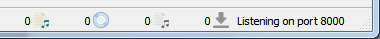

.. MusicBrainz Picard Documentation Project

:index:`Status Icons <icons; status>`
======================================

When albums and tracks are displayed in the right-hand pane, each line begins with an icon
to indicate the status of the item.

:index:`Album / Release Icons <icons; album, icons; release>`
--------------------------------------------------------------

.. |img-release| image:: images/release.png
   :width: 24pt
   :height: 24pt

|img-release|

   | This icon indicates that the information for the release has been successfully retrieved from the MusicBrainz database.  Some, but not all, tracks may have been matched to files and the information has not been modified.
   |

.. |img-release-modified| image:: images/release-modified.png
   :width: 24pt
   :height: 24pt

|img-release-modified|

   | This icon indicates that some of the tracks have been matched and that the information for the release has been modified.
   |

.. |img-release-matched| image:: images/release-matched.png
   :width: 24pt
   :height: 24pt

|img-release-matched|

   | This icon indicates that all of the tracks have been matched and that the information has not been modified.
   |

.. |img-release-matched-modified| image:: images/release-matched-modified.png
   :width: 24pt
   :height: 24pt

|img-release-matched-modified|

   | This icon indicates that all of the tracks have been matched and that the information for the release has been modified.
   |

.. |img-release-error| image:: images/release-error.png
   :width: 24pt
   :height: 24pt

|img-release-error|

   | This icon indicates that Picard has encountered an error with the release, typically while retrieving the information from the MusicBrainz database.
   |

:index:`Track Icons <icons; track>`
------------------------------------

.. |img-track-audio| image:: images/track-audio.png
   :width: 24pt
   :height: 24pt

|img-track-audio|

   | This icon indicates that the track is an audio track and that there is no single file currently matched.  This appears if there is no file matched, of if there are multiple files matched.
   |

.. |img-track-video| image:: images/track-video.png
   :width: 24pt
   :height: 24pt

|img-track-video|

   | This icon indicates that the track is a video track and that there is no file currently matched.  This appears if there is no file matched, of if there are multiple files matched.
   |

.. |img-track-data| image:: images/track-data.png
   :width: 24pt
   :height: 24pt

|img-track-data|

   | This icon indicates that the track is a data track and that there is no file currently matched.  This appears if there is no file matched, of if there are multiple files matched.
   |

.. |img-match-50| image:: images/track-match-50.png
   :width: 24pt
   :height: 24pt

.. |img-match-60| image:: images/track-match-60.png
   :width: 24pt
   :height: 24pt

.. |img-match-70| image:: images/track-match-70.png
   :width: 24pt
   :height: 24pt

.. |img-match-80| image:: images/track-match-80.png
   :width: 24pt
   :height: 24pt

.. |img-match-90| image:: images/track-match-90.png
   :width: 24pt
   :height: 24pt

.. |img-match-100| image:: images/track-match-100.png
   :width: 24pt
   :height: 24pt

|img-match-50| |img-match-60| |img-match-70| |img-match-80| |img-match-90| |img-match-100|

   | These icons indicates the quality of match between the information from the file and the information for the track as provided from the MusicBrainz database.  Red indicates a poor match, progressing to all green which indicates a very good match.
   |

.. |img-track-saved| image:: images/track-saved.png
   :width: 24pt
   :height: 24pt

|img-track-saved|

   | This icon indicates that the track has been saved successfully.
   |

.. |img-track-error| image:: images/track-error.png
   :width: 24pt
   :height: 24pt

|img-track-error|

   This icon indicates that Picard encountered an error while trying to save the track.  This is typically due to the file being marked as read-only, or you do not have sufficient permission to save the file in the specified directory.

:index:`Status Bar <icons; status bar, status bar>`
--------------------------------------------------------

There is a status bar at the bottom of Picard's main screen, which displays some information about current processing status.  This includes four numbers along with the current port number that Picard is monitoring.

From left to right, the four numbers represent:

1. The number of files loaded.
2. The number of MusicBrainz releases loaded.
3. The number of files with pending action (e.g. loading, saving, fingerprinting).
4. The number of active network requests.

You can tell whether or not Picard is currently processing your files by looking at the numbers for pending files and pending network requests. If both are 0 nothing is pending and processing is complete.

.. raw:: latex

   \clearpage
