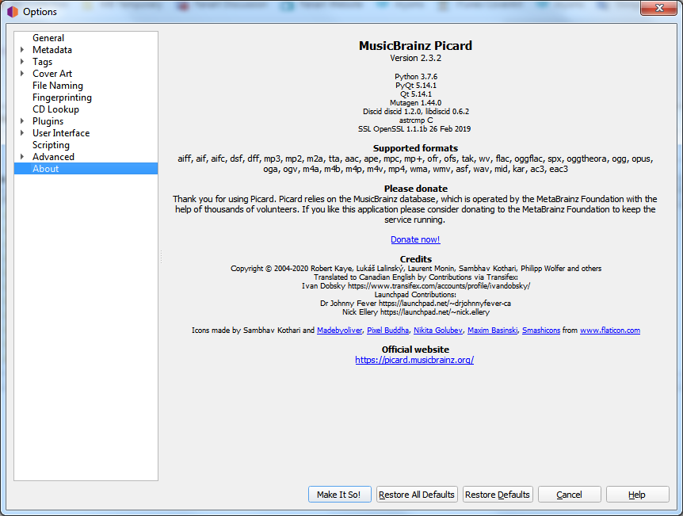

.. MusicBrainz Picard Documentation Project
.. Prepared in 2020 by Bob Swift (bswift@rsds.ca)
.. This MusicBrainz Picard User Guide is licensed under CC0 1.0
.. A copy of the license is available at https://creativecommons.org/publicdomain/zero/1.0

About
=====

This section displays information about the currently installed version of Picard.  This includes
the version number of Picard and the libraries included, a list of the file types supported, key
developer credits, and a link to the official website.  This can also be displayed using
:menuselection:`"Help --> About..."`.
