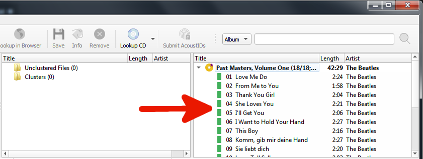

.. MusicBrainz Picard Documentation Project
.. Prepared in 2020 by Bob Swift (bswift@rsds.ca)
.. This MusicBrainz Picard User Guide is licensed under CC0 1.0
.. A copy of the license is available at https://creativecommons.org/publicdomain/zero/1.0

Matching Files to Tracks
========================

.. index::
   single: matching files to tracks

.. only:: latex

   This stage is where individual files are matched to specific tracks in the information
   retrieved from the MusicBrainz database.

Once you have retrieved the desired album information into the right-hand pane, the next step is to match the files from the
left-hand pane to the corresponding track in the right-hand pane.  A music symbol in front of a track number in the right-hand
pane indicates that there has been no file assigned to the track.  In some cases, Picard may have already tried to do the
matching for you.  If the matching wasn't done automatically, drag the appropriate files onto the appropriate album and track.

.. note::

   If you drag and drop multiple files onto a specific track the first selected file will be matched to the track on
   which you dropped the files.  The rest of the selected files will be matched to the following tracks in order.
   This allows you to quickly match multiple files to a sequence of tracks.  If you want to match all files to a single
   track instead you can hold the :kbd:`Alt` key while dropping the files.

   If you drop multiple files onto an album Picard will try to match the files to the tracks based on the metadata.

Depending on your previous metadata, Picard will try to guess the matching tracks. The order is green > yellow > orange > red,
where green is the best match. If you are seeing a lot of red and orange, it could mean that Picard has guessed incorrectly, or that
your files didn't have a lot of previous metadata to work with.  If this is the case, it's recommended to select a track and
compare the "Original Values" and "New Values" in the metadata pane. If there is an incorrect match, simply drag the track to its
correct spot in the right-hand pane.

.. image:: ../images/matching_1.png
   :width: 100%

Right-clicking an item in the track list brings up a menu of commands, including "Info", "Open in Player", "Open Containing Folder",
"Search for similar tracks", "Lookup in Browser", "Generate AcoustID Fingerprints", "Save" and "Remove".  In addition, you can
re-run any associated plugins or scripts against only the selected item.  Right-clicking an items in the left-hand pane will bring
up a similar menu of commands.

When you select an item in the right-hand pane, the original and new metadata for the item is displayed.  Right-clicking a line in
the tag list brings up a menu of commands, including "Edit", "Add to 'Preserved Tags' List", "Remove" and "Add New Tag", along with
an option to display the changed tags first.
