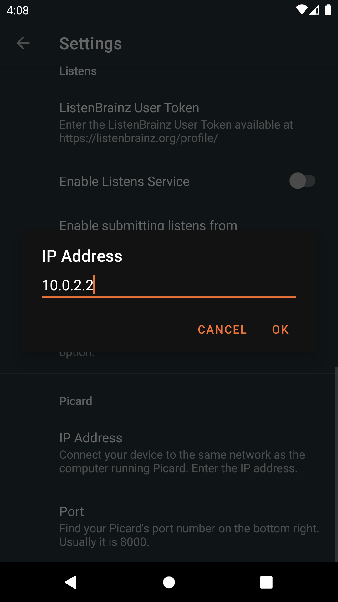

.. MusicBrainz Picard Documentation Project#

Loading releases with MusicBrainz for :index:`Android <android; app>`
=====================================================================

If you have an Android phone you can use the MusicBrainz for Android app to
search for releases by text search or by barcode and load them into Picard
running on your computer.

This is useful for example if you have previously ripped your CDs and now you
want to tag your ripped files with Picard using exactly the data for your the
releases you own.  You can then use your phone to scan the barcodes of your
CDs and have their data loaded into Picard, then use this data to tag your
local files.

For this to work you need both your phone and computer to be connected to the
same network.

Configuring Picard
------------------

In :menuselection:`Options --> Options... --> Advanced --> Network` enable
"Browser Integration" and disable "Listen only on localhost".  It is recommended
that you keep the listening port on the default value 8000, but you can change
that as well.

Once you have saved the options, check whether Picard is showing a message
"Listening on port 8000" in the status bar on the lower right of the main
window.

.. image:: images/picard-status-bar.png
   :alt: Picard status bar showing the listening port number

The actual port number can vary, but the default is 8000.  Note the
port number, you will need it to configure the Android app in the next step.

.. seealso::

    :doc:`Network options <../config/options_network>`

Installing and configuring the MusicBrainz Android app
------------------------------------------------------

Install `MusicBrainz for Android <https://github.com/metabrainz/musicbrainz-android>`_
on your phone.  You can download the latest version of the app either from the
`Google Play Store <https://play.google.com/store/apps/details?id=org.metabrainz.android>`_
or `F-Droid <https://f-droid.org/packages/org.metabrainz.android/>`_.

Once installed, launch the app and tap on the settings icon on the upper right.
Scroll down to the Picard settings.  For the IP Address enter the IP address of
your computer on which Picard is running.  Depending on your local network
setup you might also be able to enter the hostname of your computer instead of
the IP address.

For the Port enter Picard's listening port as displayed in Picard's main screen
(see the previous section).  The default is 8000.

Before you continue make sure Picard is running and the "Listening on port..."
status message is shown.  Also make sure your phone is connected to your local
network.

Loading releases by barcode
---------------------------

You can use your phone as a barcode scanner to load the metadata for your physical
media:

1. On the main screen of the Android app tap on "Scan".

   .. image:: images/android-main.png
      :width: 50 %
      :alt: MusicBrainz for Android main screen

2. Scan the barcode of a CD, LP or other music media.

   .. image:: images/android-scan.png
      :width: 50 %
      :alt: MusicBrainz for Android barcode scanner

3. If a release with the scanned barcode is found on MusicBrainz the app
   will load and show the release details.

   .. image:: images/android-release-details.png
      :width: 50 %
      :alt: MusicBrainz for Android release details

4. Tap on "Send to Picard".  If everything was configured correctly the release
   will be loaded into Picard running on your computer.

   .. image:: images/picard-result.png
      :alt: Release loaded into Picard

You can now continue tagging your local files by matching them to the loaded
tracks as described in :ref:`ref-match-files`.

.. note::

    If you only want to use the barcode scanner functionality to find and load
    releases for your physical CDs, LPs or other music media, you can also use
    the `Picard Barcode Scanner <https://github.com/phw/PicardBarcodeScanner>`_
    app.  The functionality and setup is similar to what is described above,
    but the app is focused on the barcode scanning and sending the results
    to Picard.

Loading releases by search
--------------------------

Instead of searching by barcode you can also do a text search on your phone:

1. On the main screen of the Android app tap on "Search".

   .. image:: images/android-main.png
      :width: 50 %
      :alt: MusicBrainz for Android main screen

2. On the search page select "Release" and enter a search term, e.g. an
   album title or artist name.

   .. image:: images/android-search.png
      :width: 50 %
      :alt: MusicBrainz for Android release search

3. The search results will show a list of matching releases.  Tap on one
   to show the release details.

   .. image:: images/android-release-details.png
      :width: 50 %
      :alt: MusicBrainz for Android release details

4. Tap on "Send to Picard".  If everything was configured correctly the release
   will be loaded into Picard running on your computer.

   .. image:: images/picard-result.png
      :alt: Release loaded into Picard

      
Loading releases from the Tagger
--------------------------------

Instead of searching by barcode or search, you can also do send your release from the Tagger:

1. On the main screen of the Android app tap on "Tagger".

   .. image:: images/android-main.png
      :width: 50 %
      :alt: MusicBrainz for Android main screen

2. On the tagger, select your release and click on the icon shwocasing Picard functionalities.

   .. image:: images/android-tagger.png
      :width: 50 %
      :alt: MusicBrainz for Android release search

3. If everything was configured correctly, the release
   will be loaded into Picard running on your computer.

   .. image:: images/picard-result.png
      :alt: Release loaded into Picard

.. raw:: latex

   \clearpage

..   \pagebreak
..   \newpage
..   \clearpage
