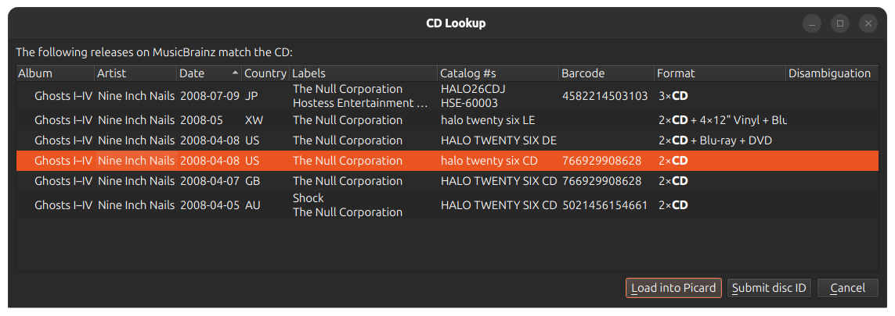
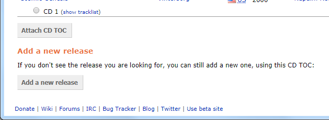

.. MusicBrainz Picard Documentation Project

:index:`Attaching a Disc ID to a Release <disc id; attaching>`
==============================================================

Disc IDs are very useful for identifying CDs and allowing MusicBrainz to know the length of tracks on a CD. Thus, it is very valuable to add them when submitting a new CD release or when you have a CD release that does not have a Disc ID attached.

.. warning::

   Please do not add DiscIDs from CDs that are burned at home.

The steps to follow to submit a disc id are:

Step 1
-------

Make sure the CD is inserted in the drive, and select :menuselection:`"Tools --> Lookup CD... --> (drive to use)"`. The CD toc will be calculated and sent to MusicBrainz. Alternately, you can use an EAC, XLD or Whipper ripper log file to lookup the CD using the :menuselection:`"Tools --> Lookup CD --> From EAC / XLD / Whipper log file..."` command. This will open a file browser dialog to allow you to select the log file to process. Either method will query the MusicBrainz database and display a list of matching releases.

.. only:: not latex

   |

Step 2
-------

If the target release appears in this list, the disc id has already been attached and you do not need to do anything further. If there are no matches found or the desired target release does not appear in the list, use the :menuselection:`"Submit disc ID"` option to locate the correct release. Enter the release title or artist and initiate the search. You will be provided with a list of the releases that match your search criterion and have the same number of tracks as your CD TOC.

.. image:: images/cd_lookup_2.png
   :align: center

.. only:: not latex

   |

.. .. raw:: latex

..    \par

.. note::

   If you search by artist, use the radio button next to the artist's name to select the desired artist. If you click on the artist's name link, you will not be allowed to attach the disc id to any of the releases displayed.

.. raw:: latex

   \clearpage

Step 3
-------

Select the desired target release frm the list displayed by clicking the radio button next to the release, and then click the "Attach CD TOC" button below the list of releases. This will prepare an edit to attach the disc id to the release. You then need to add an appropriate edit note, and submit the edit.

.. only:: not latex

   .. image:: images/add_disc_id_1.png
      :align: center

   |

.. only:: latex

   .. image:: images/add_disc_id_1.png
      :align: center
      :width: 100%

Step 4
-------

If none of the releases displayed are correct, you have the option to add a new release (with some information automatically included). The disc id will automatically be attached to the new release when the edit is saved.

.. only:: not latex

   |

.. raw:: latex

   \clearpage
