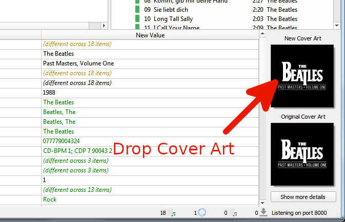
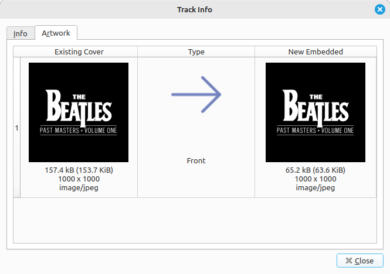

.. MusicBrainz Picard Documentation Project

:index:`Setting the Cover Art <cover art; setting>`
===================================================

.. only:: latex

   Depending on the option settings, you can change or confirm the cover art to save with a track or album.

Once the release information has been downloaded, selecting an album or track in the right-hand pane will display both the original and new coverart for the selected item. You can easily replace the coverart image used for the selected item by dragging the image from the file browser and dropping it on the New Cover Art image.

You can also choose a local file as cover art by right clicking on the image and selecting :menuselection:`"Choose local file…"` from the menu.

The menu also provides additional options including :menuselection:`"Show more details"`, :menuselection:`"Keep original cover art"`, and options for the way that images dropped onto the selection are processed. Selecting :menuselection:`"Show more details"` will bring up a new window as:

Double-clicking an image will open the image file in the system default program for the image type.
