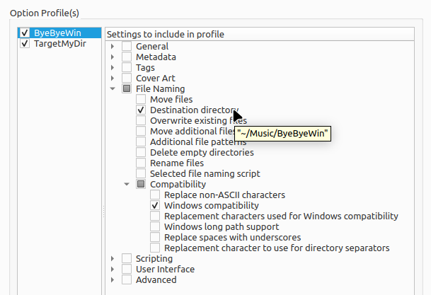
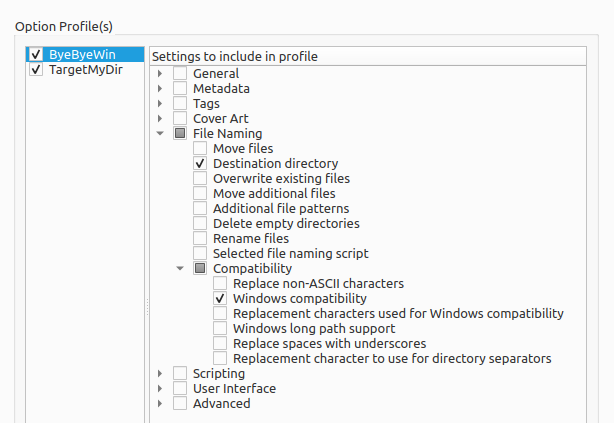
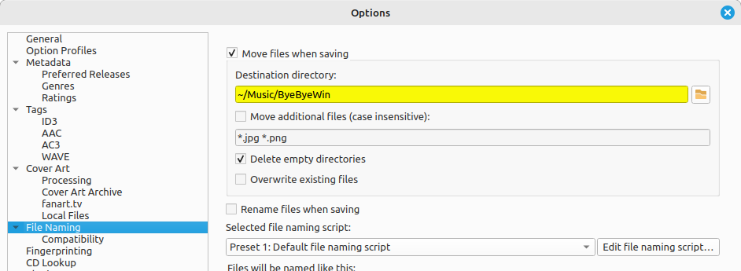
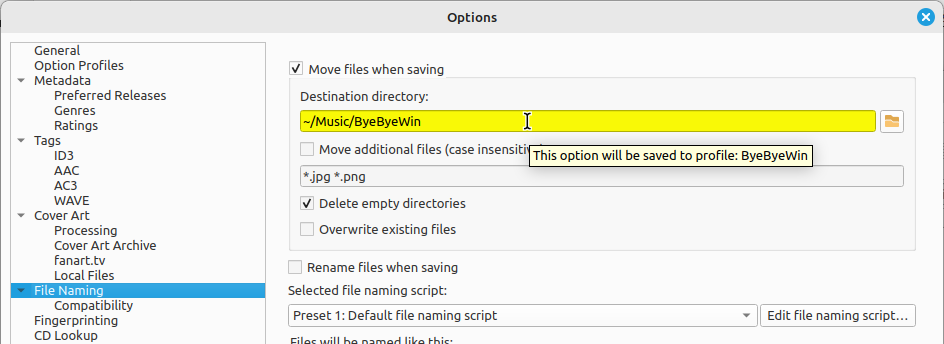
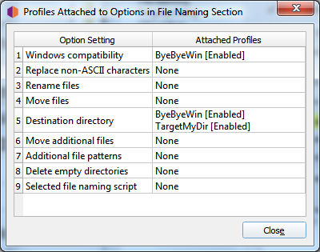

.. MusicBrainz Picard Documentation Project

Option Profiles
===============

As of version 2.7, Picard supports multiple profiles that can allow the user to quickly switch between option settings.

How Option Profiles Work
------------------------

A profile is defined by a set of options it manages.  For example, one profile may include settings for file naming such as
the target directory and which file naming script to use, while another profile may include different settings for the same
options or different options entirely (or some of each).  Profiles are stacked and processed in the order specified by the
user, from top to bottom with the lowest level being the system's "user settings" profile.  Each user-defined profile can be
enabled or disabled independently from the other user-defined profiles.  The system's "user settings" profile is always
enabled and includes all options.

When an option value is retrieved as part of Picard's processing, it comes from the first enabled profile in the stack that
manages that option. Initially, the profile stack contains only the system's "user settings" profile, which holds the
default settings for the user.

Example of Using Profiles
-------------------------

For this example, the user would like to define a set of options with alternate values, in this case a target directory where
audio files are saved (option ``move_files_to``).

The user creates a new profile (named "TargetMyDir"), adds the option ``move_files_to`` to it, and enables this profile.
The stack is now:

.. code-block::

   [x] TargetMyDir    move_files_to
   [x] user settings  move_files_to  [plus all other settings]

They change the value of ``move_files_to`` (to "target_my_dir") for this new profile.

Since the profile "TargetMyDir" is enabled, the value for ``move_files_to`` is retrieved from this profile.  The "user settings"
still has the old ``move_files_to`` value.

Now the user wants to work on another set of music files, wanting to disable ``windows_compatibility`` for this set and save
them to the "not_for_windows" directory.

They create a new profile (named "ByeByeWin"), add options ``move_files_to`` and ``windows_compatibility``, and enable it.
Now the stack looks like:

.. code-block::

   [x] ByeByeWin      move_files_to  windows_compatibility
   [x] TargetMyDir    move_files_to
   [x] user settings  move_files_to  windows_compatibility  [plus all other settings]

They change the values of ``move_files_to`` (to "not_for_windows") and ``windows_compatibility`` (to false) for this new profile.
Now when they process their files, the files are saved to the "ByeByeWin" ``move_files_to`` directory, with ``windows_compatibility`` = false.

Now the user wants to save files to the "TargetMyDir" target directory again, with their usual options.  To do this they simply
disable the "ByeByeWin" profile (which can later be re-enabled if needed).  The stack looks like:

.. code-block::

   [ ] ByeByeWin      move_files_to  windows_compatibility
   [x] TargetMyDir    move_files_to
   [x] user settings  move_files_to  windows_compatibility  [plus all other settings]

Finally, to return to their usual output directory the user only has to disable the "TargetMyDir" profile so the stack is:

.. code-block::

   [ ] ByeByeWin      move_files_to  windows_compatibility
   [ ] TargetMyDir    move_files_to
   [x] user settings  move_files_to  windows_compatibility  [plus all other settings]

Managing Option Profiles
------------------------

All option profile management is done within the Option Profiles page available from the :menuselection:`"Options -->
Options..."` item on the menu bar.  From this screen you will be able to add, copy, edit, remove, enable and disable
profiles, as well as setting the order of the profile stack.

Initially, the list of profiles will be empty.  To create a new profile click on the :guilabel:`New` button.  This will create a
profile with no options selected for the profile to manage.  To rename the profile, right-click on the profile name and
select the :menuselection:`"Rename profile"` command.  The list of options that the profile is to manage are selected from the
list in the right-hand pane.  Options can be selected either by group or individually.  The groups can be expanded to see
the individual options belonging to that group.

.. image:: images/option_profiles1.png
   :width: 100 %

You can see the value currently assigned to a profile's option setting by hovering your cursor over the setting in the list. The
value will be displayed as a tooltip for the setting.

The profile stack order can be rearranged either by selecting a profile and using the up and down arrow buttons below the
list, or by dragging the profile to a new position in the stack.  Profiles are enabled when the box beside the profile's name
is checked.

Changes made to a profile's options settings, enabled status, or position in the profile stack will be reflected in the option
settings displayed on the other pages. Options that are controlled by an enabled profile will be shown as highlighted.
Hovering your cursor over the highlighted option will identify which profile currently controls the setting. Settings are
always displayed based on the first enabled profile in the profile stack, which corresponds to the setting that will be used
during processing.

You can also quickly enable or disable a profile (but not change the order of the profile stack), using the
:menuselection:`"Options --> Enable/disable profiles"` item in the menu bar on Picard's main screen.

When you click the :guilabel:`Make It So!` button, in addition to saving your updated profile configuration all highlighted
options will be saved to the first enabled profile in the profile stack that controls that option. All other options will be
saved to the "user settings" as before.  This is described in more detail in the following section.

Saving Profile Option Settings
------------------------------

To save a value to a profile option setting, simply ensure that the the target profile is the first enabled profile in the
profile stack, make the desired changes (the options should be highlighted), and then click the :guilabel:`Make It So!` button.

Remember, all highlighted options will be saved to the first enabled profile in the profile stack that controls that option.
All other options will be saved to the "user settings" profile which is the user's normal settings, and includes all options.
You can confirm which profile a highlighted option will update by hovering your cursor over the option.

From the pages which contain options that can be included on a profile, you will also be able to see which profiles, if any,
manage any of the options on the page.  This is done by clicking the :guilabel:`Attached Profiles` button.

This lists the attached profiles in the order in which they appear in the profile stack, and whether or not the profile is
enabled.  If the page does not contain any options that could be managed by a profile, the :guilabel:`Attached Profiles` button
will be disabled.

.. warning::

   It is important to understand that when you click the :guilabel:`Make It So!` button **all** of the option settings on **all**
   pages will be saved. If an option is managed by one or more profiles that are currently enabled, the option will be highlighted
   and it will be saved to the **first** enabled profile in the profile stack that manages the option. If there are no enabled
   profiles that manage the option, the option will not be highlighted and it will be saved to the "user settings" profile which
   is the user's normal settings, contains all options, is at the bottom of the profile stack, and is always enabled.  The "user
   settings" profile cannot be modified is not shown in the profile management page.
