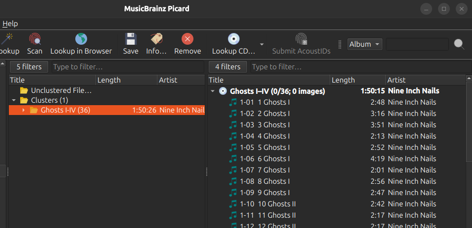

.. MusicBrainz Picard Documentation Project

Lookup CD or Ripper Log
=======================

The steps to follow to :index:`lookup a CD <lookup; cd, lookup; ripper log>` are:

Step 1
-------

Make sure the CD is inserted in the drive, and select :menuselection:`"Tools --> Lookup CD... --> (drive to use)"`. The CD TOC will be calculated and sent to MusicBrainz. Alternately, you can use a :ref:`supported ripper log file <faq_supported_rippers>` to lookup the CD using the :menuselection:`"Tools --> Lookup CD --> From CD ripper log file..."` command. This will open a file browser dialog to allow you to select the log file to process. Either method will query the MusicBrainz database and display a list of matching releases.

.. image:: images/cd_lookup_1.png
   :align: center

|

Step 2
-------

Select the correct release from the list and click on the :guilabel:`Load into Picard` button. This will load the information for the release into Picard.

A music symbol in front of a track number in the right-hand pane indicates that there has been no file assigned to the track.

|

Step 3
-------

If there are no matches or none of the matches are correct, use the :guilabel:`Submit disc ID` option to locate the correct release. Enter the release title or artist and initiate the search. You will be provided with a list of the releases that match your search criterion and have the same number of tracks as your CD TOC.

.. image:: images/cd_lookup_2.png
   :align: center

|

.. |lookup_tagger| image:: images/mblookup-tagger.png
   :height: 1em

Step 4
-------

Use the green arrow |lookup_tagger| to load the information for a release into Picard. In addition, you can select the release and attach the CD TOC.

.. image:: images/cd_lookup_3.png
   :align: center

|

.. note::

   If you looked up by artist, and made your selection by clicking on the artist's name in the list rather than selecting the artist using the radio button next to the artist's name, you will not be allowed to attach the disc id to a release.

Step 5
-------

If none of the releases displayed are correct, you have the option to add a new release (with some information automatically included).

.. image:: images/cd_lookup_4.png
   :align: center

|
