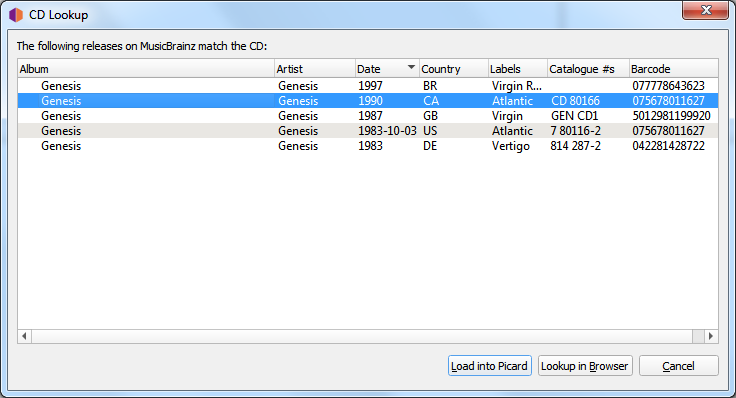
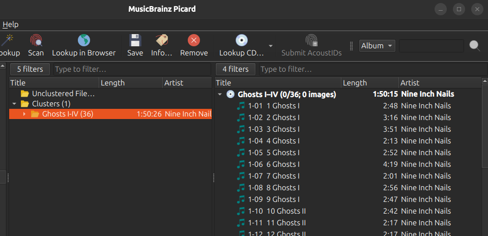

.. MusicBrainz Picard Documentation Project

Lookup iTunes Tag
=================

The steps to follow to :index:`lookup an iTunes Tag <lookup; iTunes>` are:

Step 1
-------

Select the files or cluster that you want to look up, and select :menuselection:`"Tools --> Lookup CD... --> Lookup TOC tag..."`. Picard will try to get the album TOC information from the ``itunes_cddb_1`` tag in each file to use to query the MusicBrainz database and display a list of matching releases. If there are no ``itunes_cddb_1`` tags found, then an error message will be displayed.

.. only:: not latex

   |

Step 2
-------

Select the correct release from the list and click on the :guilabel:`Load into Picard` button. This will load the information for the release into Picard.

A music symbol in front of a track number in the right-hand pane indicates that there has been no file assigned to the track.

.. only:: not latex

   |

Step 3
-------

If there are no matches or none of the matches are correct, you will have to use one of the other methods such as :doc:`Cluster and Lookup <retrieve_lookup>`, :doc:`retrieve_browser` or :doc:`retrieve_manual`.
