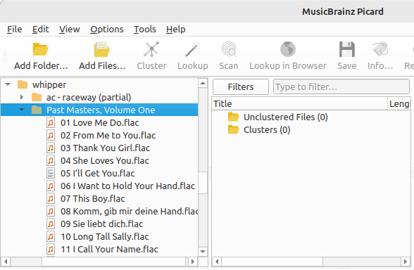
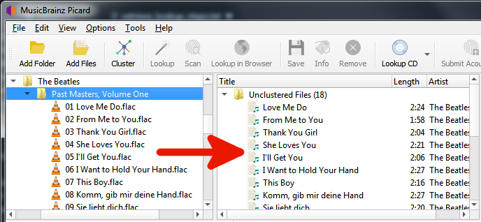
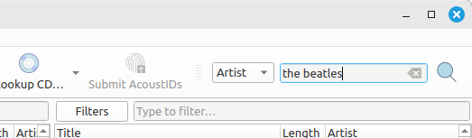
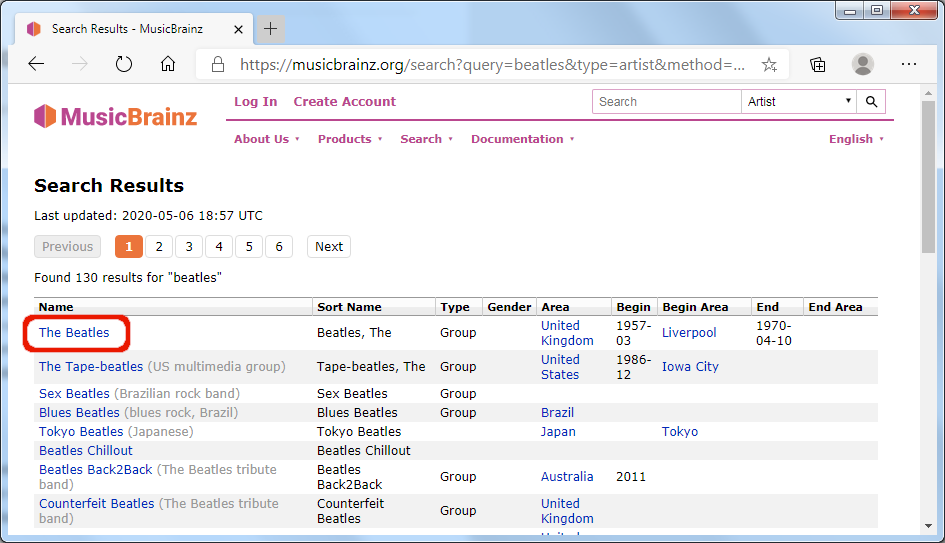
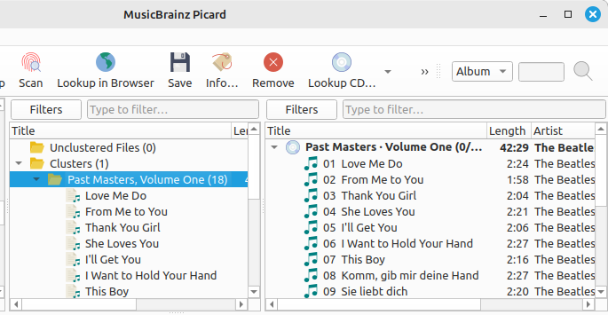

.. MusicBrainz Picard Documentation Project

Manual Lookup
=============

The steps to follow to manually lookup an album on MusicBrainz are:

Step 1
-------

Add your files using :menuselection:`"Files --> Add Files..."` or :menuselection:`"Files --> Add Folder..."`.

For ease of use it is recommended to use the internal File Browser to manage file system interactions. This is enabled from :menuselection:`"View --> File Browser"`.

|

Step 2
-------

Drag the selected directory or files to the "Unclustered Files" folder, and wait for Picard to process the files - the names will turn from grey to black.

|

Step 3
-------

Enter your search information into the search box and select the type of records to search, then click the magnifying glass symbol to initiate the search. This will open the `MusicBrainz website <https://musicbrainz.org>`_ in your browser.

|

Step 4
-------

Continue to drill down by clicking on the appropriate links until you get to the release that you want to retrieve.

|

.. |retrieve_manual_steps_lookup_tagger| image:: images/mblookup-tagger.png
   :height: 1em

Step 5
-------

Use the green arrow |retrieve_manual_steps_lookup_tagger| to load the information for a release into Picard.

.. image:: images/manual_lookup_3.png
   :align: center

|

Step 6
-------

A music symbol in front of a track number in the right-hand pane indicates that there has been no file assigned to the track.

|

.. note::

   If you enter a link to the desired entry (e.g.: ``https://musicbrainz.org/release/9383a6f5-9607-4a36-9c68-8663aad3592b``) in the search box in Picard, the entry will be loaded directly without opening a browser window.
