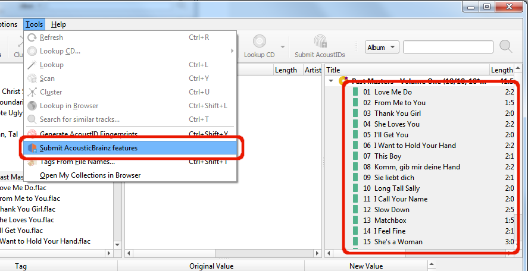

.. MusicBrainz Picard Documentation Project

:index:`Submitting Acoustic Features <AcousticBrainz; submitting, acoustic features; submitting>`
=================================================================================================

The stated goal of the `AcousticBrainz project <https://acousticbrainz.org/>`_ is to provide music technology researchers
and open source hackers with a massive database of information about music, in the hopes that this database will spur the
development of new music technology research and allow music hackers to create new and interesting recommendation engines.

This acoustic information describes the acoustic characteristics of music and includes low-level spectral information and
information for genres, moods, keys, scales and much more.  You can support this initiative by extracting the information
from your music files and submitting it to the AcousticBrainz database.

.. note::

   All information extraction from a music file is performed on your system and only this information is sent to
   AcousticBrainz.  Your actual music files are not transmitted.

To extract the information from an audio file and submit it to AcousticBrainz, simply select the tracks or releases that you
wish to submit and select the "Submit AcousticBrainz features" command from the "Tools" section of Picard's main menu bar.
If the files are properly tagged with MusicBrainz identifiers and a valid extraction application has been configured in the
:doc:`AcousticBrainz option settings <../config/options_acousticbrainz>`, then the files will be added to a queue where they
will be processed in the background.

If there is no valid extraction application identified, or if the "AcousticBrainz features extraction" option has not been
enabled in the AcousticBrainz option settings, then the "Submit AcousticBrainz features" command will be unavailable.

.. raw:: latex

   \clearpage
