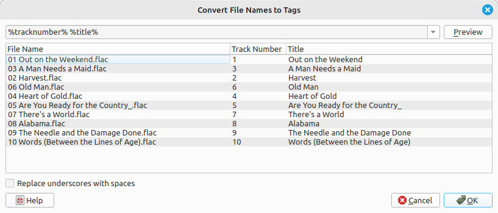
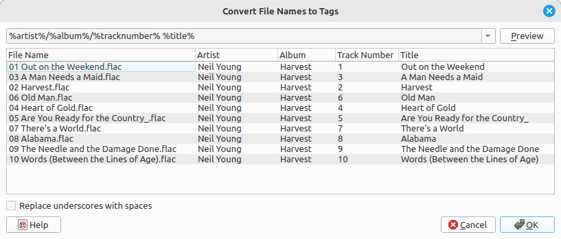

.. MusicBrainz Picard Documentation Project

Generating :index:`tags from file names`
=========================================

Sometimes files have poor quality tags or no tags at all, but the file names are well structured and
follow a pattern. In this case you can use :menuselection:`"Tools --> Tags From &File Names..."` to
generate the tags from the file names.

Basic usage
-----------

To use this tool, select one or more files loaded into Picard and open the Tags From File Names
dialog from the menu at :menuselection:`"Tools --> Tags From &File Names..."`.  The dialog will
show you a list of filenames and an input field at the top where you can enter a matching pattern.

The matching pattern can consist of Picard tag names enclosed in ``%`` signs and other characters
that are matched verbatim.  For the tag names you can use predefined names such as ``%artist%``,
``%album%``, or ``%title%`` (see :doc:`../variables/variables`) or use custom names.  There are a
few predefined patterns available to select from, but you can also adjust them or set your own.

If your files for example consist of a track number and track title separated by a space
(e.g. :file:`04 Heart of Gold.mp3`) you can use the matching pattern :samp:`%tracknumber% %title%`.
Should the track number and title be separated by for example a hyphen like :file:`04 - Heart of Gold.mp3`
the pattern needs to also include this separator, like :samp:`%tracknumber% - %title%`.

Clicking on the "Preview" button next to the matching pattern will show a preview of the extracted
tags for each file name.  Once you are satisfied with the result, you can accept the changes with
the "Ok" button.  The changed tags will be set for the files.  Note that the changes will not be
saved automatically, you still need to save the files if you want the tags to be written
(see :doc:`save`).

Matching folders
----------------

The pattern can also match the parent folders of the file. To match for folders use a slash (``/``)
as separator.  If for example the file is in a folder named after the album, which in turn is
inside a folder named after the artist (i.e. :file:`Neil Young/Harvest/04 Heart of Gold.mp3`) you
could match the artist, album, track number and title with a pattern of
:samp:`%artist%/%album%/%tracknumber% - %title%`.

Replace underscores with spaces
-------------------------------

Sometimes files have been named without spaces and use underscores instead.  For example a file
could be named :file:`04_Heart_of_Gold.mp3`.  By default the title would get extracted as
"Heart_of_Gold".  In this case enable the checkbox "Replace underscores with spaces" and use a
pattern like :samp:`%tracknumber%_%title%` to extract the title properly as "Heart of Gold".

Ignoring parts of the file name
-------------------------------

Sometimes you don't want to include parts of the file name in your tags and just want to ignore them.
The pattern must always match the entire file name, though.  In this case you can use a hidden
variable for the parts of the file name you do not want to match to an actual tag.  Hidden variables
start with an underscore like :samp:`%_dummy%`.  This variable will still be available on the file
for :doc:`../extending/scripting`, but will not get written to the actual file tags on saving.

One example might be if you want to extract only the track number from a file name like
:file:`04 Are You Ready for the Country_.mp3`.  Maybe the track number tag is missing in the file,
but the title tag is already properly set.  You could use the pattern :samp:`%tracknumber% %_filetitle%`.
This would extract the ``tracknumber`` tag properly, but would extract the rest of the file name
to a hidden variable :samp:`%_filetitle%` which would not get written to the file tags. The name
:samp:`%_filetitle%` is arbitrarily chosen, it just needs to start with an underscore.

.. note::

   Parsing hidden variables from file names is supported since Picard 2.5.  Earlier versions
   would create an actual tag which would get stored to the tags.  If you are using a Picard
   version older than 2.5 you will need to remove the unwanted tags before saving the files.

.. raw:: latex

   \clearpage
