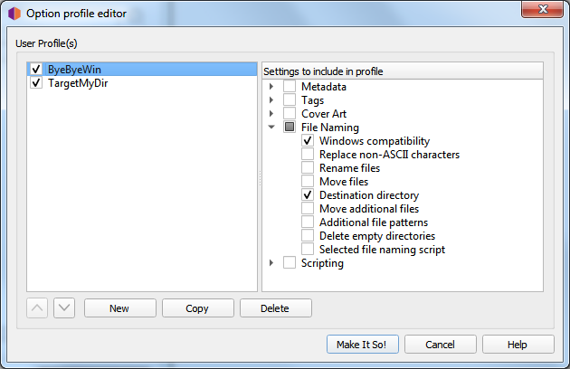

.. MusicBrainz Picard Documentation Project

User Profiles
=======================

As of version 2.7, Picard supports multiple user profiles that can allow the user to quickly switch between option settings.

How User Profiles Work
------------------------

A profile is defined by a set of options it manages.  For example, one profile may include settings for file naming such as
the target directory and which file naming script to use, while another profile may include different settings for the same
options or different options entirely (or some of each).  Profiles are stacked and processed in the order specified by the
user, from top to bottom with the lowest level being the system's "user settings" profile.  Each user-defined profile can be
enabled or disabled independently from the other user-defined profiles.  The system's "user settings" profile is always
enabled and includes all options.

When an option value is retrieved as part of Picard's processing, it comes from the first enabled profile in the stack that
manages that option.  Similarly, when a new value is set for an option in the :menuselection:`Options...` window, the change
will only be applied to the first enabled profile in the stack that manages that option.

Initially, the profile stack contains only the system's "user settings" profile, which holds the default settings for the user.

Example of Using Profiles
--------------------------

For this example, the user would like to define a set of options with alternate values, in this case a target directory where
audio files are saved (option ``move_files_to``).

The user creates a new profile (named "TargetMyDir"), adds the option ``move_files_to`` to it, and enables this profile.
The stack is now:

.. code-block::

   [x] TargetMyDir    move_files_to
   [x] user settings  move_files_to  [plus all other settings]

Since the profile "TargetMyDir" is enabled, any change to ``move_files_to`` is done within this profile, and "user settings"
still has the old ``move_files_to`` value.

Now the user wants to work on another set of music files, wanting to disable ``windows_compatibility`` for this set and save
them to the "not_for_windows" directory.

They create a new profile (named "ByeByeWin"), add options ``move_files_to`` and ``windows_compatibility``, and enable it.
Now the stack looks like:

.. code-block::

   [x] ByeByeWin      move_files_to  windows_compatibility
   [x] TargetMyDir    move_files_to
   [x] user settings  move_files_to  windows_compatibility  [plus all other settings]

They change the values of ``move_files_to`` (to "not_for_windows") and ``windows_compatibility`` (to false).  Now when they
process their files, the files are saved to the "ByeByeWin" ``move_files_to`` directory, with ``windows_compatibility`` = false.

Now the user wants to save files to the "TargetMyDir" target directory again, with their usual options.  To do this they simply
disable the "ByeByeWin" profile (which can later be re-enabled if needed).  The stack looks like:

.. code-block::

   [ ] ByeByeWin      move_files_to  windows_compatibility
   [x] TargetMyDir    move_files_to
   [x] user settings  move_files_to  windows_compatibility  [plus all other settings]

Finally, to return to their usual output directory the user only has to disable the "TargetMyDir" profile so the stack is:

.. code-block::

   [ ] ByeByeWin      move_files_to  windows_compatibility
   [ ] TargetMyDir    move_files_to
   [x] user settings  move_files_to  windows_compatibility  [plus all other settings]

Managing User Profiles
-----------------------

All user profile management is done within the User Profile Editor screen available from the :menuselection:`"Options -->
User Profiles..."` item on the menu bar.  From this screen you will be able to add, copy, edit, remove, enable and disable
profiles, as well as setting the order of the profile stack.

Initially, the list of profiles will be empty.  To create a new profile click on the :guilabel:`New` button.  This will create a
profile with no options selected for the profile to manage.  To rename the profile, right-click on the profile name and
select the :menuselection:`Rename profile` command.  The list of options that the profile is to manage are selected from the
list in the right-hand pane.  Options can be selected either by group or individually.  The groups can be expanded to see
the individual options belonging to that group.

The profiles stack order can be rearranged either by selecting a profile and using the up and down arrow buttons below the
list, or by dragging the profile to a new position in the stack.  Profiles are enabled when the box beside the profile's name
is checked.

When you are satisfied with your changes, click the :guilabel:`Make It So!` button to store them and exit the profile editor screen.
Use the :guilabel:`Cancel` button to exit without saving your changes.

.. note::

   Creating a new profile, or adding new options to an existing profile, does not save the settings for the options.  The
   option settings will only be updated when you make and save changes in the :menuselection:`"Options --> Options..."` dialog,
   and only if the profile is the first enabled one in the stack that manages those options.

To update the settings for the options managed by the new profile, the recommended steps are:

1. Enable the new profile and disable all others.  This is the safest way to avoid accidentally applying changes to another profile.
2. Exit the profile editor and open the :menuselection:`Options...` screen.
3. Make the desired changes to the options managed by the profile, and save them using the :guilabel:`Make It So!` button.
4. Return to the profile editor and set the stack order and enabled profiles as desired.
